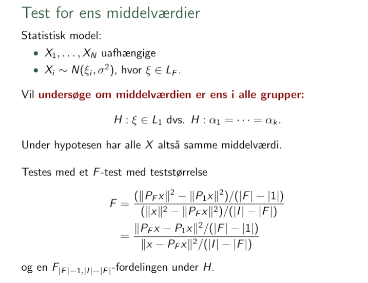

------------------------------------------------------------------------

```{=html}
<!-- RMD tips:
1. CTRL+SHIFT+C RMD-comments-out the selected lines, with in a standard HTML comment-out format. 

2. CTRL+ALT+I inserts a new r codechunck

3. Pressing CTRL+SHIFT+ENTER when over a code chunck gives you a preview of the results of the chunck

4. CTRL+SHIFT+K gives you a preview of the entire resulting HTML file.

5. Note the different results of '#HS 1' and 
'# HS 1' (without the '') in the output

6. It is possible to compile regular R-scripts into Rmd files - this is done by pressing CTRL+SHIFT+K while attending any R-script. <<<- Though this apparently doesn't work for HS Problems.R for some reason!?!?!? ->>>

7. Selective use of the echo=c(...) option within code chuncks allows assignment of a variable, to show the assignment in the knitted document, and showing the value of the assignment seamlessly as well - see HS2.3

8. It is possible to include results of R-analysis such as summary statistics in LaTeX-equations in RMD, see HS2.3

9. Adding fig.align="center" to a code chunk centers any figures generated by the chunck.

9.1 note that properties of codechunks seem casesensitive; fig.align="center" centers a figure, but fig.align="Center" (with capital C) doesn't

10. A new subtitle needs a blank line before itself: 
'works:

#### HS 7
'

'doesn't:
blablabla
#### HS 7
'

'doesn't either:
<!-- blablabla ->
#### HS 7
'
11. Pressing F7 when marking, or hovering over a word will spellcheck the word

12. CTRL + - (minus) zooms out, CTRL + + (plus) zooms in

13. CTRL + D Deletes the current line, or current selection of lines

14. THE FOLLOWING SOURCE EDITOR FOLDING METHODS:
14.1 Collapse current fold: ALT + L
14.1.1: Expand current fold: SHIFT + ALT + L
14.2 Collapse "all" subfolds: ALT + O <- !?!! Note that this leaves a small letter 'o' in the text !!?!
14.2.1 Expand "all" subfolds: SHIFT + ALT + O
14.3 Collapse all other folds: ALT + 0 (zero)

15. SHIFT + ALT + J allows you to jump to specific parts of the document

16. Writing a new line with '...' will cause all previous output to be hidden in the knittet document

17. Writing (q<-5) around R code, will both assign and print the code upon assignment 

18. Note that 'attach' only has the scope of the current R-chunck.

19. One way to get pdf printout is to compile a html-printout, and then, in-browser, 'print' the HTML page as a pdf.

20. CTRL + SHIFT + M gives the pipe operator.

21. Pressing CTRL + F3 searches on the selected word.

22. CTRL
-->
```
<!-- ---?--- How do I create a closeable Rmd section, such that I do not have to scroll through the LaTeX commands each time? - !!! Can be done with '-----' through this also creates a line in the knittet document. -->

<!-- How do I publish and share the HTML as a viewable (and linkable) website - this can be done through github? -->

<!-- How can I share R markdown files such that multiple people can edit them at the same time? -->

<!-- Do we need parindent controls as in LaTeX? -->

<!-- Use of the cache function to reduce recompile times -->

<!-- How to close current subsection with a keyboard shortcut? How to close subsubsections,...? - !!!See RMD tip 14!!! -->

<!-- Chunk naming? -->

<!-- How to define variables such that they have scope within their own ## segment? -->

<!-- How do I delete all non-needed variables for each new section in R??? -->

<!-- LaTeX commands -->

\newcommand{\C}{\mathbb{C}} <!--- Komplekse tal --->

\newcommand{\R}{\mathbb{R}} <!--- Reelle tal--->

\newcommand{\Q}{\mathbb{Q}}

<!---Rationelle tal--->

\newcommand{\Z}{\mathbb{Z}}

<!---Hele tal--->

\newcommand{\N}{\mathbb{N}}

<!---Naturlige tal--->

\newcommand{\E}{\mathbb{E}}

<!---mean--->

\newcommand{\F}{\mathbb{F}}

<!---Baggrundsrum sigma-alg--->

\newcommand{\B}{\mathbb{B}}

<!---Borel sigma--->

\newcommand{\K}{\mathbb{K}}

<!---Generel field--->

\newcommand{\RB}{\overline{\R}}

<!---Udvidede reelle tal--->


\newcommand{\ms}[1]{\mathscr{#1}}
\newcommand{\mc}[1]{\mathcal{#1}}
\newcommand{\BR}{\mathcal{B}\left(\R\right)} <!---Borel på Reelle tal -->
\newcommand{\BRB}{\mathcal{B}\left(\RB\right))} <!---Borel på udvidede reelle tal -->


\newcommand{\mf}[1]{\mathfrak{#1}} 
\newcommand{\mcG}[2]{\mathcal{#1}^1(#2)} 
\newcommand{\mcGG}[4]{\mathcal{#1}_{#3}^{#2}(#4)}
\newcommand{\GMR}{\left(X,\ms{A},\mu\right)} <!---Generelt målrum -->

\newcommand{\PBS}{\lrp{\Omega,\F, P}}

<!--- Probability background space -->

\newcommand{\RMR}{\left(\R,\BR, \lambda\right)}

<!---Reelt målrum, m. Borel, og lebesgue mål. -->

\newcommand{\MRBPBR}{\mc{M}_{\RB}^+\left(\BR\right)}

<!---Mængden af positive målelige funktioner som sender (R,BR) over i (RB, BRB) -->

\newcommand{\MRPBR}{\mc{M}_{\R}^+\left(\BR\right)}

<!---Mængden af positive målelige funktioner som sender (R,BR) over i (R, BR) -->

<!---L_p spaces on [0,1] with m -->


\newcommand{\Lp}[1]{L_{#1}\lrp{\lrs{0,1},m}} 
\newcommand{\mclxy}{\mc{L}\lrp{X,Y}}

<!---Bounded linear functionals from X to Y -->

\newcommand{\mckxy}{\mc{K}\lrp{X,Y}}

<!---Compact Bounded linear functionals from X to Y -->

\newcommand{\mssr}{\ms{S}(\R)}

<!---The Schwartz space on $\R$ -->

<!---Arrows -->

\newcommand{\ra}{\rightarrow} <!---Konvergens pil højre -->
\newcommand{\nra}{\nrightarrow} <!---ikke Konvergens pil højre -->
\newcommand{\la}{\leftarrow} <!---Konv pil venstre -->
\newcommand{\nla}{\nleftarrow} <!---ikke Konvergens pil venstre -->
\newcommand{\lra}{\leftrightarrow} <!---højre venstre pil -->
\newcommand{\nlra}{\nleftrightarrow} <!---ikke højre venstre pil -->
\newcommand{\hra}{\hookrightarrow} <!---Injektiv  pil højre -->
\newcommand{\Ra}{\Rightarrow} <!---Implikations pil højre -->
\newcommand{\Lra}{\Leftrightarrow} <!---Bi-implikations pil -->
\newcommand{\Uda}{\Updownarrow} <!---Bi-implikations pil (op og ned) -->
\newcommand{\Da}{\Downarrow} <!---implikations pil (ned) -->
\newcommand{\rhpu}{\rightharpoonup} <!---Weak convergence in Hilbert spaces -->

<!-- LHS & RHS calculations -->

\newcommand{\swel}{\overset{\swarrow}{=}} <!---Continue calculation on left hand side with equality -->
\newcommand{\sweq}{\overset{\swarrow}{\equiv}} <!---Continue calculation on left hand side with equivalence -->
\newcommand{\seel}{\overset{\searrow}{=}} <!---Continue calculation on right hand side with equality -->
\newcommand{\seeq}{\overset{\searrow}{\equiv}} <!---Continue calculation on right hand side with equivalence -->
\newcommand{\inse}{\overset{\cdot}{=}} <!--- Insert values in calculation -->

\newcommand{\PMX}{\mc{P}\left(X\right)} <!---Potensmængde af X -->
\newcommand{\comp}{\mathsf{c}} <!---Set compliment -->
\newcommand{\sm}{\setminus} <!---mængdedifferens -->

<!--- Parenteser --->
\newcommand{\lrp}[1]{\mathopen{}\left({#1}\right)\mathclose{}} <!-- \left("STUFF"\right) -->
\newcommand{\lrc}[1]{\mathopen{}\left\{{#1}\right\}\mathclose{}} <!-- \left\{"STUFF"\right\} -->
\newcommand{\lrs}[1]{\mathopen{}\left[{#1}\right]\mathclose{}} <!-- \left["STUFF"\right] -->
\newcommand{\lrb}[1]{\mathopen{}\left|{#1}\right|\mathclose{}} <!-- \left|"STUFF"\right| -->
\newcommand{\inner}[2]{\mathopen{}\left\langle #1, #2 \right\rangle\mathclose{}}  <!-- <\left"STUFF1","STUFF2"\right> -->
\newcommand{\norm}[1]{\mathopen{}\left\lVert#1\right\rVert\mathclose{}} <!-- \left||"STUFF"\right|| -->
\newcommand{\floor}[1]{\lfloor #1 \rfloor} <!---Floor function --->
\newcommand{\ceil}[1]{\lceil #1 \rceil} <!---ceil --->
\newcommand{\FFou}[1]{\mc{F}(#1)} <!---Fourier Transform notation 1 --->
\newcommand{\Fou}[1]{\widehat{#1}} <!---Fourier Transform notation 2 --->

<!--- Farver --->
\newcommand{\blue}[1]{\textcolor{blue}{{#1}}} <!--- Turning text blue --->
\newcommand{\red}[1]{\textcolor{red}{{#1}}} <!--- Turning text red --->
\newcommand{\green}[1]{\textcolor{green}{{#1}}} <!--- Turning text green --->
\newcommand{\purple}[1]{\textcolor{purple}{{#1}}} <!--- Turning text purple --->
\newcommand{\cyan}[1]{\textcolor{cyan}{{#1}}} <!--- Turning text cyan --->
\newcommand{\orange}[1]{\textcolor{orange}{{#1}}} <!--- Turning text orange --->

<!--- Oversetting bold accents --->
\newcommand{\boldhat}[1]{\mathbf{\hat{\text{$#1$}}}}
\newcommand{\boldbar}[1]{\mathbf{\bar{\text{$#1$}}}}
\newcommand{\boldtilde}[1]{\mathbf{\tilde{\text{$#1$}}}}
\newcommand{\boldcheck}[1]{\mathbf{\check{\text{$#1$}}}}

\newcommand{\indep}{\perp \!\!\! \perp} <!---independence --->
\newcommand{\colvec}[1]{\begin{pmatrix}{#1}\end{pmatrix}} <!-- Begin column vector - Doesn't seem to work with non-column vectors...-->


\newcommand{\nd}[2]{\mc{N}\lrp{{#1},{#2}}} <!-- Normal distribution -->
\newcommand{\dnd}[2]{\sim\mc{N}\lrp{{#1},{#2}}} <!-- Distributed as Normal distribution -->

<!-- \newcommand{\Rlogo}{{#id .class width=auto height=16px} } <!-- R logo implemented in text -->

<!-- Image insertion alla LaTeX doesn't seem to work too well..., but inserting the above gives the desired effect. -->

<!--???? \declareMathOperator{\SE}{SE} DOESN'T REALLY SEEM TO WORK????-->

```{r setup, include=FALSE}
knitr::opts_chunk$set(echo = TRUE)
knitr::opts_chunk$set(cache = TRUE) #semi-dangerous to set cache true globally :||
library(tidyverse)
library(gridExtra)
theme_set(theme_minimal())
library(MASS)
set.seed(314)
varnametotext <- function(v){
   deparse(substitute(v))
}
Stdresplot <- function(model, main = paste("(Estimate, Std. Res.)-plot of", deparse(substitute(model))), ylab ="Standardized residuals", ...) {
 fit <- fitted(model)
 rst <- rstandard(model)
 qplot(fit, rst, main = main, ylab = ylab, ylim = c(-max(3.2,max(abs(rst))), max(3.2,max(abs(rst)))) )+geom_hline(yintercept = 0) #Largest symmetric interval (around 0) of (-3.2,3.2) or (-largest absolute rst, largest absolute rst)
}
QQplotdraw <- function(model, main = paste("Normal QQ-plot of", deparse(substitute(model))), xlab = "Theoretical Quantiles", ylab ="Sample Quantiles", ...) {
   rst <- rstandard(model)
   #dataname <- getCall(lm_LT)$data
   ggplot(data = eval(getCall(model)$data), main = main, xlab = xlab, ylab = ylab) + geom_qq() + geom_qq_line() + aes(sample = rst)
} #main, xlab, ylab call do not work for some reason
StdresQQPlot <- function(model,...) {
   p1 <- Stdresplot(model,...)
   p2 <- QQplotdraw(model,...)
   #library(gridExtra)
   grid.arrange(p1,p2, ncol = 2)
}
```

# HS Problems

## HS 1 (In danish)

<!-- ### **I et forsøg indgik  `r nrow(cats)` katte, nemlig ** -->

#### **1.**

Vi kører de efterspurgte kommandoer <!-- Bemærk at CTRL+ALT+I indsætter en ny R-kodeblok --> <!-- Hvordan fravælger vi at printe,... forskellige linjer, istedet for at vælge dem vi gerne vil til? --> <!-- Hvordan får vi R til at vise library(MASS), og cats linjerne, uden at evaluerer dem, og uden at vi fravælger at "eval" dem, således at de vises med ## foran sig??? - Results lader ikke til at virke ala Rmarkdown cookbook kapitel 11.7 -->

```{r, eval = c(3,4,5)}
library(MASS)
cats
head(cats)
dim(cats)
summary(cats)
```

Vi kan samtidigt også importere cats et datasæt i R i stedet for som en del af `cats` pakken, idet vi erklærer;

```{r}
cats <- cats
```

#### **2.**

Bemærk at vi i `cats` datasættet har med forskellige enheder at gøre. Specifikt er det således at `Bwt` er i kilogram, mens `Hwt` er i gram. For at udregne forholdet mellem `Hwt` og `Bwt`, for så da at kunne omsætte til procent, må vi altså have dem på samme enhed. I dette tilfælde vil vi regne i kg, så vi ganger `Hwt` med $1=\frac{1kg}{1000g},$ for da at tage forholdet `Hwt/Bwt` og tilsidst gange med $100$ for at få resultatet i procent. Den resulterende transformation, efterfulgt af et fornyet kig på `head(cats)`

```{r}
cats <- transform(cats, pct = (cats$Hwt/1000)*(1/cats$Bwt)*100)
head(cats)
```

Således at vi eksempelvis i række to har at hjertevægten af kat nummer to udgør smålige $0,37\%$ af kropsvægten af katten - overraskende lidt.

#### **3.**

As requested we may subset `cats` with the `subset` function, remembering that any gentleman always defines `femaleData` first;

```{r}
femaleData <- subset(cats, cats$Sex == "F")
maleData <- subset(cats, cats$Sex == "M")
head(femaleData)
head(maleData)
```

## HS 2

<!-- !!! Remember to run the HS1 code chuncks, as these are needed for HS2. !!! -->

<!-- ??? Is there some way to "import" the previous formatting of data / automatic way to make sure that the required code chuncks are run? ??? -->

#### **1.**

We will be testing a linear regression model on the data prepared in HS1. Starting off with a `(Bwt,Hwt)` scatterplot, note once again that `Hwt` is in units of grams, with `Bwt` being in kilograms.

```{r fig.align="center"}
plot(cats$Bwt,cats$Hwt, main = "(Bwt, Hwt) scatterplot", xlab = "Cat bodyweight in kg", ylab = "Cat heartweight in g")
```

<!-- Kildehåndtering i Rmd???? -->

<!-- See RMD VISUAL GUIDE in links folder -->

The statistical model behind the linear regression may be recited from Definition 6.1 of "Introduktion til Statistik".

<!-- \begin{center} -->

<!-- We assume $Y_1,\ldots,Y_n \overset{\text{iid.}}{\sim}\mc{N}(\alpha+\beta x_i,\sigma^2),\,\alpha,\beta\in\R,\,\sigma^2>0$ being unknown parameters. -->

<!-- \end{center} -->

<!-- Why does the above LaTeX approach not work, while the HTML approach below does? - What other LaTeX formatting is off limits? -->

<center>

*We assume $Y_1,\ldots,Y_n \overset{\text{iid.}}{\sim}\mathcal{N}(\alpha+\beta x_i,\sigma^2),\,$with $\alpha,\beta\in\mathbb{R},\,\sigma^2>0$ being unknown parameters.*

</center>

<!--Check out https://pandoc.org/MANUAL.html#extension-link_attributes for details of how to include an inline picture - in our case the R-logo -->

<!-- How do I create a command which does the insertion of the R logo as below??? - LaTeX approach doesn't seem to work -->

Finally we will for `maleData` be using the `lm`-function in {#id .class width="auto" height="16px"} to fit the linear regression model to the `maleData`, assuming heartweight to be a linear function of bodyweight such that we might write `Hwt` $= \alpha + \beta\,\cdot$`Bwt`.

```{r}
linreg <- lm(Hwt ~ Bwt, data = maleData)
fortify(linreg)
```

#### **2.**

<!-- Kildehåndtering og referencer? - Referencer til at BibTeX er muligt set et eller andet sted -->

Further following the procedures of Chapter 6 (in particular page 133) in "Introduktion til Statistik" we might complete a visual model validation of our linear regression model <!-- OVERSÆTTELSE AF MODELKONTROL --> by getting {.class width="auto" height="16px"} to calculate the estimated values of the model, and the standardized residuals of the data also. Respectively, this will be done with the assignment

```{r}
fit <- fitted(linreg)
rst <- rstandard(linreg)
```

such that we might plot the fitted values against the standardized residuals, adding a horizontal line through zero also <!-- Hvordan ændre vi udseenet++ af punkterne i standard R plots? -->

```{r fig.align="center"}
plot(fit, rst, main = "(Estimate, Std. Res.)-plot for linreg model on maleData", xlab = "Estimated (fitted) Heartweight (g)", ylab ="Standardized residuals", ylim = c(-max(3.2,max(abs(rst))), max(3.2,max(abs(rst)))) ) #Largest symmetric interval (around 0) of (-3.2,3.2) or (-largest absolute rst, largest absolute rst)
abline(0,0)

```

<!-- Hvordan laver man figurtekst???? -->

<!-- Referencer/hyperlinks til tidligere steder i dokumentet, codechucks/figurer/ligninger???? -->

Looking at the above plot, we note that if the assumption that the variance of the heartweight data is independent of the mean is true, we would expect that the dispersion of points at region of fitted heartweight values would be akin to the dispersion in any other region.If the linearity assumption of our model were to be true, we would expect the points to be relatively equally dispersed as $\mathcal{N}(0,1)$ on both sides of $0$ across the fitted values. - ie. that the standardized residuals are themselves rather $\mathcal{N}(0,1)$ distributed.

The plot looks rather respectable on both these fronts, as 1. The residual values fall within the interval $\left({-2,2}\right),$ as would be expected of a standard normal distribution. 2. No wierd "trumpet", "quadratic" or other wierd distortions to the std. residuals values are present, they seem to keep rather constantly dispersed around zero within any fitted heartweight region.

Note that the values of

```{r}
mean(rst)
var(rst)
```

fit in line.

Finally the assumption that the heartweight data is normally distributed may be visually assessed through the use of a QQ-plot of the standardized residuals. If the normallity assumption of the model were to be true we would expect the standardized residuals to be $\mathcal{N}(0,1)$ distributed, which would reveal itself if the points if the theoretical $\mathcal{N}(0,1)$ quantiles were to match the empirical quantiles of the standardized residuals, such that the points of the QQ-plot were to hug the line intersecting the mean $0$ and with slope equal to the standard deviation of an $\mathcal{N}(0,1)$ distributed value, ie. with slope $\sqrt{1}=1$. The plot and the corresponding line intersecting $0$ and having slope $1$ can be made with the commands below

```{r fig.align="center"}
qqnorm(rst)
abline(0,1)
```

<!-- How to center figure, without centering r code??? -->

revealing that no sufficiently large abnormalities seem to be present that would disprove our theory that the standardized residuals are $\mathcal{N}(0,1)$ distributed, and thus, that the data follows a normal distribution also. Do however observe, that making a QQ-plot of the data itself won't lead to much fruition, as the means are assumed to vary according to the bodyweight (unless ofcourse we have $\beta=0$).

All in all, we say that it seems fairly reasonable to assume that the data is distributed according to the above written model. <!-- Henvisninger til modellen hvordan?!!! -->

#### **3.**

A valueable way to get insight into the linear regression model made by {.class width="auto" height="16px"} is to deploy the `summary` function.

```{r}
summary(linreg)
```

which reveals a rather lot of details around the fitted linear model. Information of how to interpret the output of `summary` may be found through the `?lm`-command.

Another valuable trick is that it is possible to draw out the slope($\beta$) and intersect ($\alpha$) values for the linear regression of the data, and use these to define local variables `beta` and `alpha` through <!-- Better way to get output and assignment???? -->
c(1,2,3,4)
```{r, echo=c(1,3)}
alpha <- linreg$coefficients[[1]]
alpha
beta <- linreg$coefficients[[2]]
beta
```

Noting the use of `[[]]` to extract the numerical value instead of a named value as results from using

```{r}
linreg$coefficients[1]
linreg$coefficients[2]
```

Alternatively the format,

```{r}
as.numeric(linreg$coefficients[1])
as.numeric(linreg$coefficients[2])
```

evidently works as well.

We have thus established the model that `maleData$Hwt =` `r alpha` `+` `r beta` `maleData$Bwt`. <!-- How to write the above equation better??!?! --> As the rate change of an affine function is constant we may just note that an increase in bodyweight of $0.5kg,$ will by the model provide an `0.5 beta =` `r 0.5*beta`gram increase in heartweight.

Note that the model is rather imperfect, as it for example for `maledata$Bwt` $\searrow 0 kg$ estimates `maleData$Hwt` $\searrow `r alpha` g$. <!-- The above must be possible to write better somehow --> And while the above problem to the model is of course in itself preposterous, we may note that if we wanted to force {.class width="auto" height="16px"} to fit the best linear model to the data assuming intersection at zero, we might've done this through the use of `linreg <- lm(Hwt ~ Bwt - 1, data = maleData)` ie. with the inclusion of "-1" being the symbolic manipulation required to tell {.class width="auto" height="16px"} to model based on the assumption of intersection in $0.$ <!--!!! Bemærk dog at kommandoerne med [[1]],[[2]], og as.numeric([1]), as.numeric([2]) giver fejl i tilfældet med ~ Bwt -1, idet R fjerner den af [[1]],... eftersøgte information helt, og at vi dermed med [[1]],... forsøger at hive data ud af linreg den slet ikke har. !!!--> <!--??? Hvad er det nu lige kommandoen for "hvis fejl så hop da bare videre" er? ???-->

#### **4.**

Let us just remind ourselves of the standard frequentistic interpretation ascribed to confidence intervals of level $1-\alpha^*$ <!-- Level?? - Er det den rigtige oversættelse?? --> for the parameter $\beta$:

Imagine the experiment being conducted multiple times in the same way, but independent of the original and each other - in our case a new batch of cats being weighed, their sex noted, and their heartweight noted also. Using the dataset corresponding to each repetition of experiment we calculate the $1-\alpha^*$ confidence intervals for $\beta$ (as will be done below). We would then expect the true value of $\beta$ to be present in approximately ratio $1-\alpha^*$ of all the intervals calculated.

From Theorem 6.9 in "Introduktion to Statistik" we have that an $1-\alpha^*$ confidence-interval for $\beta$ can be found as the interval bounded by $$\hat{\beta}\pm t_{n-2,1-alpha^*/2}SE(\hat\beta)$$ Note that we may find the standard error for $\beta,\,SE(\hat\beta)$ in `summary(linreg)` as "std error for Bwt", which is `0.3399` in our instance. Extraction of this value might occur via

```{r, echo=1}
seb <- sqrt(diag(vcov(linreg)))[[2]]
seb
```

```{=html}
<!-- Notice the following warm up to the above extraction;
vcov(linreg)
diag(vcov(linreg))
sqrt(diag(vcov(linreg)))
sqrt(diag(vcov(linreg)))[2]
-->
```
<!-- That we once again might also have used as.numeric(sqrt(diag(vcov(linreg)))[2]) -->

```{=html}
<!-- Note also that we may also extract the above value with 
summary(linreg)$coefficients["Bwt","Std. Error"]
-->
```
```{=html}
<!-- And finally that the extraction of SE(alpha^) can happen with 
sqrt(diag(vcov(linreg)))[[1]] 
-->
```
Having taken a look at `?qt` as well as an extra look at Theorem 6.9, we may in order to get an $95\%$ confidence interval do

```{r, echo=c(1,3,4,5)}
n <- nrow(maleData)
n
lKI <- beta - qt(0.975, n-2)*seb
uKI <- beta + qt(0.975, n-2)*seb
KI <- c(lKI, uKI)
KI
```

ie we get the $95\%$ confidence-interval `(`r lKI`,`r uKI`)`. <!-- !!! DET VIRKER MEGA GODT med denne R-notation !!! -->

#### **5.**

Having browsed `?confint` we may refind the results of the previous subproblem with `confint(linreg)` as follows;

```{r}
confint(linreg)
#We try to extract the interval;
confint(linreg)[2,]
as.numeric(confint(linreg)[2,]) #KI
confint(linreg)[2,1] #lKI
confint(linreg)[2,2] #uKI
```

#### **6.**

For $x_i$ being the bodyweight data and $Y_i$ being the stochastic variable representing the heartweight both of the $i$'th male cat, we will by assumption have $E(Y_i)=\alpha + \beta x_i.$ Finding a designmatrix $A$ such that we way write $\xi:=\left({E(Y_1), E(Y_2), \ldots, E(Y_{97})}\right)^T$ as $$
\xi=A\begin{pmatrix}
\alpha\\
\beta
\end{pmatrix}.
$$ Consequently, as $\xi\in M_{97,1}(\mathbb{R}),\,\left({\alpha, \beta}\right)^T\in M_{2,1}(\mathbb{R}),$ we will by matrix multiplication need to have $A\in M_{97,2}(\mathbb{R}),$ and in particular for \begin{align*}
A\begin{pmatrix}
\alpha\\
\beta
\end{pmatrix}
\overset{\swarrow}{\equiv}
\begin{pmatrix}
a_{1,1} & a_{1,2} \\
a_{2,1} & a_{2,2} \\
\vdots & \vdots \\
a_{97,1} & a_{97,2}
\end{pmatrix}\begin{pmatrix}
\alpha\\
\beta
\end{pmatrix}&\overset{\swarrow}{=}
\begin{pmatrix}
a_{1,1}\alpha + a_{1,2}\beta \\
a_{2,1}\alpha + a_{2,2}\beta \\
\vdots \\
a_{97,1}\alpha+a_{97,2}\beta 
\end{pmatrix}\overset{\searrow}{=}\begin{pmatrix}
\alpha + \beta x_1 \\
\alpha + \beta x_2 \\
\vdots \\
\alpha + \beta x_{97} \\
\end{pmatrix}\overset{\searrow}{\equiv}\xi\\
&\Leftrightarrow\\
a_{i,1}\equiv 1&,\,\,a_{i,2}=x_i\\
&\Leftrightarrow\\
A&=\begin{pmatrix}
1 & x_1 \\
1 & x_2 \\
\vdots & \vdots \\
1 & x_{97}
\end{pmatrix}
\end{align*}

## HS 3

<!-- Automatiske kommandoer til at lave #### **n.** som funktion af at være n.-1+1 i hver ## sektion -->

#### **1.**

We may recite the (normal) statistical model of two independent samples as given in D. 5.1 of "Introduktion til Statistik";

<center>

*Let $X_1,\ldots,X_{n_1}$ and $Y_1,\ldots,Y_{n_2}$ be independent normally distributed random variables with $X_i\sim\mathcal{N}(\mu_1,\sigma^2)$ and $Y_j\sim\mathcal{N}(\mu_2,\sigma^2),$ with $\mu_1,\mu_2\in\mathbb{R}$ and $\sigma^2>0$ being unknown parameters*

</center>

#### **2.**

We will calculate estimates for the mean and variance of every imaginable parameter below

```{r, results=F}
mean(femaleData$Bwt) #2.359574
mean(femaleData$Hwt) #9.202128
mean(femaleData$pct) #0.3915119

#--

mean(maleData$Bwt) #2.9
mean(maleData$Hwt) #11.32268
mean(maleData$pct) #0.3894547

#-

var(femaleData$Bwt) #0.07506938
var(femaleData$Hwt) #1.843256
var(femaleData$pct) #0.002630804

#--

var(maleData$Bwt) #0.2185417
var(maleData$Hwt) #6.46323
var(maleData$pct) #0.002858461

```

Though noting that we for our particular analysis happen to be interested in the data `femaleData$pct` and `maleData$pct` each a sample of the entire `cats` thus making two samples.

#### **3.**

Note that our model has three primary assumptions;

1.  The observations in `cats$pct` are independent

2.  The variance of the `femaleData$pct` is equal the variance of the `maleData$pct` (variance homogeneity)

3.  The observations are normally distributed.

<!--!!! Notice the way in which the enumerated list above is created !!!-->

<!--??? Make different enumerated lists ???-->

The independence assumption will usually follow from the method by which the experiment is conducted and the data is collected.

Observe from the above calculations in particular that

```{r, results = F}
mean(femaleData$pct) #0.3915119
mean(maleData$pct) #0.3894547

var(femaleData$pct) #0.002630804
var(maleData$pct) #0.002858461
```

<!-- Aaarrrhh, den går vist ikke helt????, vi antager at femaleData$pct_1,...,femaleData$pct_47 ~ N(mu_1,sigma^2),maleData$pct_1,...,maleData$pct_47 ~ N(mu_2,sigma^2) ikke at var(femaleData$pct_1,...,)=var(maleData$) -->

the latter pair fitting rather well with our assumption of variance homogeneity between `femaleData$pct` and `maleData$pct` - more precisely we may say that on the basis of data, we do not yet see any reason to doubt variance homogeneity as an assumption.

Note that we might define the following histogram-making, and normal density overdrawing function, to then make a histogram with density estimates overlayed for each of `femaleData$pct,maleData$pct` <!-- Bedre måde at sætte to figurer ved siden af hinanden? - Hvorfor insisterer Rmd cookbook på at have figure-side og par(...) med? --> <!-- Implementering af varnametotext i NHist - hvordan???? -->

```{r fig.show="hold", out.width="50%"}
NHistDensityDraw<-function(varname, xlab = deparse(substitute(varname)), main = paste("Histogram of", deparse(substitute(varname))), ...) {
  
  #Draws normaldistribution density on top of a histogram.
  
  seqT<-seq(min(varname),max(varname), by = 1/(5*10^4*(max(varname)-min(varname)))) #Counts from minimum of data to maximum of data via the by mechanism
  
  f1T<-dnorm(seqT,mean=mean(varname),sd=sd(varname)) #creating density
  maxf1T <- max(f1T)
  hist(varname, prob=1, ylim=c(0,maxf1T), xlab = xlab, main = main, ...) #Drawing histogram, making sure we get the entire height of the density estimate
  
  lines(seqT,f1T) #Drawing density
}

NHistDensityDraw(femaleData$pct)
NHistDensityDraw(maleData$pct)
```

which also doesn't provide a cause for concern to our model assumptions. Getting to the meat of of the modelcontrol, we may introduce qq-plots for the two datasets

```{r fig.show="hold", out.width="50%"}
qqnorm(femaleData$pct, main = "Female QQ Plot")
abline(mean(femaleData$pct),sd(femaleData$pct))

qqnorm(maleData$pct, main = "Male QQ Plot")
abline(mean(maleData$pct),sd(maleData$pct))

```

Heed that in both plots, the data seems to hug the empirical line rather well, thus providing no immediate refutiation of `femaleData$pct` or `maleData$pct` being normally distributed.

<!-- What are we to do with the independence assumption??? - Independence between the groups? - independence within each group? - independence within the entire dataset -->

#### **4.**

<!-- Bestem et estimat for den forventede forskel mellem pct for hun- og hankatte?????? - hvad skal det betyde - et estimat på forskel kunne være 0????  -->

Looking through `t.test` we may note that a $95\%$ confidence interval for the expected difference bewteen `femaleData$pct` and `maleData$pct` may be obtained through

```{r}
t.test(femaleData$pct, maleData$pct, paired = F, var.equal = T)
```

noting that we have specified that we are not dealing with a paired two sample - we assume independence between the two groups of female, male data respectively. - Someplace we find a paired analysis is in drugtrials with the groupings "before taking drug" and "after taking drug". As we sample twice from each person, a rather stark dependence between the samples occures, as people are rather non-independent of themselves.

We also include `var.equal = T`, thus telling {.class width="auto" height="16px"} that we assume variance homogeneity between the two samples.

Note that we may extract the confidence interval via

```{r}
KI <- as.numeric(t.test(femaleData$pct, maleData$pct, paired = F, var.equal = T)[[4]])
KI
lKI <- KI[1]
uKI <- KI[2]
```

Note that as $0$ is firmly placed in the confidence interval, there is not immidiately any evidence to say that there is a percentagewise difference in `heartweight/bodyweight` between male and female cats.

<!-- What's the theory behind the t.test and its execution with different parameters enabled/disabled - how does one conduct such a test manually? -->

#### **5.**

Having looked at `?confint` we may use the requested commands;

```{r}
fit <- lm (pct ~ Sex, data=cats)
summary(fit)
confint(fit)
```

```{r, eval=F, include = F}
#A couple of different ways of extracting the residual standard error
summary(fit)$sigma
summary(fit)[[6]]
sqrt(deviance(fit)/df.residual(fit))
```

We may then for example extract the residual standard error through <!-- Hvad dælan er det lige der sker herunder? -->

```{r, echo = c(1,3)}
rstderr <- sqrt(deviance(fit)/df.residual(fit))
rstderr
rstderr^2
```

#### **6.**

For $Z_1,\ldots,Z_{144}$ being the stochastic variables representing `pct` for the `r nrow(cats)` cats, we have assumed $E(Z_i)=\mu_1,\,E(Z_j)=\mu_2$ for $i=1,\ldots,97,\,j=98,\ldots,144$ respectively representing the male and female cats. We may proceed as with HS2.6 <!-- Referencer?!!! --> as we endevour to write a designmatrix $C$ such that for $\eta:=\left({E(Z_1),\ldots,E(Z_{144})}\right)^T\equiv\left({\mu_1,\ldots,\mu_1,\mu_2,\ldots,\mu_2}\right)$

$$
\eta=C\begin{pmatrix}
\mu_1\\
\mu_2
\end{pmatrix}.
$$
Consequently, as $\eta\in M_{144,1}(\mathbb{R}),\,\left({\mu_1, \mu_2}\right)^T\in M_{2,1}(\mathbb{R}),$ we will by matrix multiplication need to have $C\in M_{144,2}(\mathbb{R}),$ and in particular for \begin{align*}
C\begin{pmatrix}
\mu_1\\
\mu_2
\end{pmatrix}
\overset{\swarrow}{\equiv}
\begin{pmatrix}
c_{1,1} & c_{1,2} \\
c_{2,1} & c_{2,2} \\
\vdots & \vdots \\
c_{144,1} & c_{144,2}
\end{pmatrix}\begin{pmatrix}
\mu_1\\
\mu_2
\end{pmatrix}&\overset{\swarrow}{=}
\begin{pmatrix}
c_{1,1}\mu_1 + c_{1,2}\mu_2 \\
c_{2,1}\mu_1 + c_{2,2}\mu_2 \\
\vdots \\
c_{144,1}\mu_1 + c_{144,2}\mu_2 
\end{pmatrix}\overset{\searrow}{=}\begin{pmatrix}
\mu_1\\
\vdots\\
\mu_1\\
\mu_2\\
\vdots\\
\mu_2
\end{pmatrix}\overset{\searrow}{\equiv}\eta\\
&\Leftrightarrow\\
c_{i,1}\equiv 1_{\left\{{1,\ldots,97}\right\}}(i)&,\,\,c_{i,2}=1_{\left\{{98,\ldots,144}\right\}}(i)\\
&\Leftrightarrow\\
C&=\begin{pmatrix}
1 & 0 \\
\vdots & \vdots \\
1 & 0 \\
0 & 1 \\
\vdots & \vdots \\
0 & 1
\end{pmatrix}
\end{align*}

## HS 4

#### **1.**

#### **2.**

#### **3.**

## HS 5

#### **1.**

#### **2.**

#### **3.**

#### **4.**

#### **5.**

## HS 6

#### **1.**

Note that for $X_1,...,X_{10} \sim\mathcal{N}(0,1),$ we may, for example by NRH problem 1.1, convolution results, or C9.46 in EH (MatStat Bind 2) conclude regarding the desired distribution. Define in accordance with C9.46 $C:=\frac{1}{n}\left({1,\ldots,1}\right)\in\mathbb{R}^{1\times10},\,X:=\left({X_1,\ldots,X_{10}}\right)^T$ that $\overline{X}\equiv\frac{1}{n}\sum_{i=1}^{n}{X_i}\equiv CX \sim \mathcal{N}_1(C\cdot0,CIC^T)=\mathcal{N}_1(0,\frac{1}{n^2}n)=\mathcal{N_1}(0,\frac{1}{n}),$ which is also in accordance with the result reached in NRH1.1.

#### **2.**

We may test this result through `gent` number of simulations of $10$ outcomes of $\mathcal{N}(0,1),$ that we will be averaging over; <!-- ---?--- How do we get R to report gent as 5000, or of the form "gent = 5000" with gent defined further down that it is introduced? -->

<!-- ---?--- How do I get the breaks of the histogram to cross 0, such that we have unequal symmetry? -->

<!-- ---?--- How do I add extra room on top of my histogram, so that the entire dnorm curve is included? -->

```{r fig.align = "center"}
n<-10
gent <- 5*10^3
gns <- rep(NA,gent)

for (i in 1:gent) {
  X<-rnorm(n,0,1)
  gns[i] = 1/n*sum(X)
}

hist(gns, prob = T, ylim = c(0.0,1.3))
f<- function(x) dnorm(x,mean=0,sd=1/sqrt(n)) 
plot(f,-1,1,add=T)

```

Note also that we might we might create a QQ-plot for the data;

```{r fig.align = "center"}
qqnorm(gns)
abline(0,1/sqrt(n))

```

for which we see that by Introduktion til Statistik p. 68, everything is as it should be.

#### **3.**

For each outcome of $X_1,\ldots,X_{10}$ as $x_1,\ldots,x_{10},$ denote by $x_{(1)}\leq x_{(2)}\leq\ldots\leq x_{(10)}$ the ordering of the outcomes. As such the median $\widehat{X},$ of $X_1,\ldots,X_{10}$ will equal to $\frac{x_{(5)}+x_{(6)}}{2},$ and can be calculated with `median` {.class width="auto" height="16px"}-command.

```{r, include = FALSE}
QT<-rnorm(10,0,1)
median(QT)
QT
QT[order(QT)]
QT5<-QT[order(QT)][5]
QT6<-QT[order(QT)][6]
(QT5+QT6)/2

```

So, lets reimplement the above method; <!-- ---?--- Hvordan transporterer man 'gent' variablen  <- KØR DE TIDLIGERE SEKTIONER ---!--- -->

```{r}
med<-rep(NA,gent)
for (i in 1:gent) {
   X <- rnorm(n, 0, 1)
   med[i] <- median(X)
}

```

```{r fig.align="center"}
hist(med, prob=TRUE, ylim = c(0.0,1.25)) # Normeret histogram
f <- function(x) dnorm(x, mean=0, sd=1/sqrt(n))
plot(f,-1,1,add=TRUE)
#Den tegnede tæthed passer vist ikke helt, idet den designerede tæthed lader til at være mere sammentrykket (højere modus) end histogrammet
hist(med, prob=TRUE, ylim = c(0.0,1.25))
f_2<-function(x) dnorm(x, mean= 0, sd = sd(med))
#Med den empiriske lader det til at gå lidt bedre.
plot(f_2,-1.2,1.2,add = T)

```

```{r, echo = TRUE, fig.align="center"}
qqnorm(med)
#qqline(med)
mean(med)
sd(med)
abline(0,sd(med))

```

With `mean(med)=` `r mean(med)` and `sd(med)=` `r sd(med)`, it seems reasonable by the QQ-plot to assume that the median is going to be distributed approx. as $\mathcal{N}(0,`r sd(med)^2`).$

Comparing the estimates for the variance of $\overline{X}$ and $\widehat{X}$ we see

```{r, echo = T}
var(gns)
var(med)

```

with the variance of the mean generally being a good bit lower than the variance of the median.

We may do a scatterplot of the mean against the median as follows;

```{r fig.align="center"}
plot(x = gns, y = med, xlim = c(-1.1,1.1), ylim = c(-1.1,1.1))
```

<!-- Here it looks a fair bit like the variance of med should be lower than the variance of gns - and yet it is not - what is up with this? -->

We may also use `?cor` to understand that

```{r, echo = T}
cor(gns, med)
```

is to be interpreted as ...

## HS 7

#### **1.**

For $X$ being a two dimensional stochastic variable with $$EX=\begin{pmatrix}{1\\0}\end{pmatrix},\,VX=
\begin{pmatrix}
4&4\\
4&16
\end{pmatrix}
$$ that as $\begin{pmatrix}{1\\0}\end{pmatrix}=EX \equiv E\begin{pmatrix}{X_1\\X_2}\end{pmatrix} \equiv \begin{pmatrix}{EX_1\\EX_2}\end{pmatrix}$ we get $EX_1=1,\,EX_2=0.$ In the same way $$
\begin{pmatrix}
4&4\\
4&16
\end{pmatrix}=VX\equiv\begin{pmatrix}
VX_1&cov(X_1,X_2)\\
cov(X_2,X_1)&VX_2
\end{pmatrix}\equiv
\begin{pmatrix}
VX_1&cov(X_1,X_2)\\
cov(X_1,X_2)&VX_2
\end{pmatrix}
$$ grants us $VX_1=4,\,VX_2=16,\,Cov(X_1,X_2)\equiv Cov(X_2,X_1) = 4,$ and thus $$
Corr(X_1,X_2):=\frac{Cov(X_1,X_2)}{\sqrt{VX_1\,VX_2}}\overset{\cdot}{=}\frac{4}{\sqrt{64}}=\frac{4}{8}=\frac{1}{2}.
$$

#### **2.**

For $Y\equiv\begin{pmatrix}{Y_1\\Y_2}\end{pmatrix}:=\begin{pmatrix}{X_1+2\\X_2-X_1+1}\end{pmatrix},$ we get $$
EY\equiv\begin{pmatrix}{EY_1\\EY_2}\end{pmatrix}\equiv\begin{pmatrix}{E(X_1+2)\\E(X_2-X_1+1)}\end{pmatrix}=\begin{pmatrix}{EX_1+2\\EX_2-EX_1+1}\end{pmatrix}\overset{\cdot}{=}\begin{pmatrix}{1+2\\0-1+1}\end{pmatrix}\equiv\begin{pmatrix}{3\\0}\end{pmatrix}.
$$

In calculating the matrix $VY$ we may use one of two methods;

<details>

<summary>**Method 1: The Direct method**</summary>

We also have $$
VY_1\equiv V\lrp{X_1+2}\overset{\text{MI L16.17}}{=}VX_1=4,
$$ and $$
VY_2\equiv V\left({X_2-X_1+1}\right)\overset{\text{MI L16.17}}{=}V\left({X_2-X_1}\right).
$$

<details>

<summary>**MI L19.13 expansion**</summary>

Let $Z,Q$ being r.v.r.v.'s variables defined on a common background space $\left({\Omega,\mathbb{F}, P}\right).$ If both $Z,Q$ have second moments then $$
V\left({Z\pm Q}\right) = VZ + VQ \pm 2Cov(Z,Q)
$$

</details>

As both $X_1,X_2$ have second moment, such that $\left({X_1,X_2}\right)$ by MI E19.8 has covariance, we may thus by the expansion of MI L19.13 above conclude 
$$
VY_2 = V\left({X_2 - X_1}\right) \overset{\text{L19.13}}{=}VX_2+VX_1-2Cov(X_2,X_1)\underset{\text{MI L19.12}}{\overset{\cdot}{=}} 4+16-2\cdot4=12.
$$

<details>

<summary>**MI L19.12 expansion**</summary>

Let $Z,Q,W$ being r.v.r.v.'s variables defined on a common background space $\left({\Omega,\mathbb{F}, P}\right).$ If both $\left({Z,Q}\right),\,\left({Z,W}\right)$ have covariance then 
$$
Cov(Z,Q\pm W) = Cov(Q\pm W, Z) = Cov(Q,Z)\pm Cov(W,Z) = Cov(Z,Q)\pm Cov(Z,W)
$$

</details>

Having shown above that $Y_1$ and $Y_2$ both have finite variance and thus finite second moments, we may by the MI L19.12 expansion above conclude \begin{align}

Cov(Y_1,Y_2)&\equiv Cov(X_1+2,X_2-X_1+1)\\
\overset{\text{MI (19.8)}}{=}&Cov(X_1,X_2-X_1)\\
\overset{\text{MI L19.12}}{=}&Cov(X_1,X_2)-Cov(X_1,X_1)\\
\equiv& Cov(X_1,X_2)-VX_1\overset{\cdot}{=}4-4=0

\end{align}

As such we altogether get 
$$
VY\equiv\begin{pmatrix}4&0\\0&12\end{pmatrix}.
$$ 
<!-- aligned-overset doesn't seem to work???!!!! -->

</details>

<details>

<summary>**Method 2; The Matrix method**</summary>

For $A:=\begin{pmatrix}1&0\\-1&1\end{pmatrix},\,b:=\begin{pmatrix}{2\\1}\end{pmatrix}$ note that $Y=AX+b.$ As such by <!-- WHAT RESULT?? --> \begin{align}
VY &\equiv V\left({AX+b}\right)\\
&= V\left({AX}\right)\\
&= AVXA^T\\
&\equiv\begin{pmatrix}1&0\\-1&1\end{pmatrix}\begin{pmatrix}4&4\\4&16\end{pmatrix}\begin{pmatrix}1&-1\\0&1\end{pmatrix}\\
&=\begin{pmatrix}1&0\\-1&1\end{pmatrix}\begin{pmatrix}4&0\\4&12\end{pmatrix}\\
&=\begin{pmatrix}4&0\\0&12\end{pmatrix}
\end{align}

</details>

#### **3.**

No we cannot conclude that $Y_1,Y_2$ are independent just because they have covariance $0.$ In general we only have 
$$
Y_1,Y_2\text{ independent} \Rightarrow Cov(Y_1,Y_2)=0
$$ 
and only (?) in the case in which $Y_1,Y_2\sim\mathcal{N}$ do we have 
$$
Y_1,Y_2\text{ independent and normally distributed} \Leftrightarrow Cov(Y_1,Y_2)=0.
$$

#### **4.**

For $A:=\begin{pmatrix}1&0\\-1&1\end{pmatrix},\,b:=\begin{pmatrix}{2\\1}\end{pmatrix}$ note that $Y=AX+b,$ as presented in the matrix-method of subproblem2. By EH K9.46 as $X$ is now assumed regularly normally distributed, we will thus have $Y\sim\mathcal{N}\left({{A\xi+b},{AVXA^T}}\right)=\mathcal{N}\left({{EY},{VY}}\right)\overset{\cdot}{=}\mathcal{N}\left({{\begin{pmatrix}{3\\0}\end{pmatrix}},{\begin{pmatrix}4&0\\0&12\end{pmatrix}}}\right).$

## HS 8

#### **1.**

Note that we might define new vectors 
$$
\tilde{p}_0(x):=p_0(x)\equiv1,\quad \tilde{p}_1(x):=p_1(x)\equiv x,\quad \tilde{p}_2(x):=\frac{p_2(x)+p_0(x)}{3}\overset{\cdot}{=}\frac{3x^2-1+1}{3}=x^2,
$$
which most definitely span $\mathscr{P}_2\equiv\left\{{f:\,\left({-1,1}\right)\rightarrow\mathbb{R}^2|\exists a_0,a_1,a_2\in\mathbb{R},\,f(x)=a_2x^2+a_1*x+a_0}\right\}$, and as we have transfered from $\left({p_0,p_1,p_2}\right)$ to $\left({\tilde{p}_0,\tilde{p}_1,\tilde{p}_2}\right)$ using only linear combinations, we will also have that we may therefore conclude that $\left({p_0,p_1,p_2}\right)$ must too be a basis for $\mathscr{P}_2$ 

#### **2.**

```{r}
p0 <- function(x) 1
p1 <- function(x) x
p2 <- function(x) 3*x^2 - 1
p12 <- function(x) p1(x)*p2(x)
integrate(p1,-1,1)
integrate(p2,-1,1)
integrate(p12,-1,1)
```

#### **3.**

Note as described in the problem that as $\left\lVert p_0\right\rVert^2=2,\,\left\lVert p_1\right\rVert^2=\frac{2}{3},\,\left\lVert p_2\right\rVert=\frac{8}{5},$ we may define an orthonormal basis for $\mathscr{P}_2$ as \begin{equation}
e_0(x):=\\frac{1}{\\sqrt{2}},\\quad e_1(x)=\\sqrt{\\frac{3}{2}}x,\\quad e_2(x):=\\sqrt{\\frac{5}{8}}(3x\^2-1),
\\end{equation} in {.class width="auto" height="16px"} with

```{r}
e0 <- function(x) {1/(sqrt(2))}
e1 <- function(x) {sqrt(3/2)*x}
e2 <- function(x) { sqrt(5/8)*(3*x^2-1)}
```

<!-- Unexpected end of document without {}?!?!?!?!?! -->

<!-- Kildehenvisninger????!!!! -->

Note now, that by C9.28 in EH, we may for $Y_0,Y_1,Y_2\sim\mathcal{N}(0,1)$ write any regular normal distributed random variable $X$ on $\mathscr{P}_2$ with precision $\inner{\cdot}{\cdot},$ and center $\xi$ as the sum $$X:=\sum_{n=0}^{2}{Y_ie_i}+\xi.$$ Implementing this in {.class width="auto" height="16px"} we get

```{r}
xi <- c(0,0,0)
Y_0 <- rnorm(1)
Y_1 <- rnorm(1)
Y_2 <- rnorm(1)

X <- function(x) {Y_0*e0(x)+Y_1*e1(x)+Y_2*e2(x) + xi}
```

<!-- Skal vi have tredimensionelt xi???? -->

We may also plot the simulated function;

```{r fig.align="center"}
plot(X,-1,1)

```

#### **4.**

We continue from subproblem 3, but before we do, we will shorten the construction from 3; Note we may construct a function that simulated our desired function as follows;

```{r}
f <- function(x) {
   temp <- rnorm(3)
   X <- temp[1]*e0(x)+temp[2]*e1(x)+temp[3]*e2(x)
   return(X)
}
```

As such, we may do the desired simulation as follows

```{r, warning=F, fig.align="center"}
plot(0,0, type="n", xlim=c(-1,1), ylim=c(-3,3), xlab="x", ylab="f(x)")
for (i in 1:25) {
plot(f,-1,1, add=TRUE) }
```

<!-- How to vary colours in the plot?!  -->

#### **5.**

For $X$ regularly normally distributed on $\mathscr{P}_2$ with center $0$ and precision $\left\langle \cdot, \cdot \right\rangle$ Defining $Z:=t(X),$ as

## HS 9

#### **1.**

#### **2.**

#### **3.**

#### **4.**

#### **5.**

#### **6.**

#### **7.**

## HS 10

#### **1.**

#### **2.**

## HS 11

#### **1.**

Having already completed EH 10.5 in RMD we may copy the assignment of $X$ and $A$ with

```{r}
A <- matrix(c(1,0,1,-1,1,-1,1,1,1,1), nrow = 5, ncol = 2, byrow = T) #By col is default
X <- c(-0.187,-1.731,-0.184,2.252,1.775)
```

#### **2.**

We note that we may reproduce the calculated estimates for $\alpha_1,\alpha_2,\sigma$ through `lm` with <!-- HVORFOR HAR VI -1 denne gang? -->

```{r}
model <- lm(X~A-1)
model.matrix(model)
summary(model)
```

Looking through `?model.matrix` enlightens us a bit as to the output of `model.matrix(model)` Note that we find the estimate for $\alpha_1,\,\hat\alpha_1$ under `[A1,Estimate Std.]`, $\alpha_2,\,\hat\alpha_2$ under `[A2,Estimate Std.]` and the estimate for $\sigma,\,???$ under `Residual standard error` <!-- for the centralestimate $\tilde\sigma$????!!!!! --> We may extract these three estimates with the below commands, noting that

```{r, echo=1:4}
model$coefficients[[1]] #alphahat_1
model$coefficients[[2]] #alphahat_2
summary(model)$sigma #sigmatilde
sigmatilde2 <- (summary(model)$sigma)^2 #sigmatilde^2
sigmatilde2
```

#### **3.**

Having checked `?vcov`, note the output of `vcov` and `solve(t(A)A)`-commands;

```{r}
vcov(model)
solve(t(A)%*%A)
```

On an inkling that there "might" be a connection between `sigmatilde,vcov(model),solve(t(A)%*%A)` note that 
<!-- NOTE THAT WE NEED TO REDEFINE `sigmatilde2` (as we did in subproblem 2) in order for knitr to compile the code below into the final document. The reason is that `sigmatilde2` was defined as a variable in R in EH10.5, the RMD section of which is below HS11 -->
```{r}
solve(t(A)%*%A)*sigmatilde2 #Fits rather well with vcov(model)
```
Referring back to EH 10.5 and the distribution of the MLE mean $\hat\alpha\dnd{\alpha}{\tilde\sigma^2\lrp{A^TA}^{-1}},$ this isn't entirely surprising, when noting the fact that `vcov(model)` - by `?vcov` itself describes its functionality as;
<center>
*Returns the variance-covariance matrix of the main parameters of a fitted model object. The “main” parameters of model correspond to those returned by coef, and typically do not contain a nuisance scale parameter (sigma).*
</center>

#### **4.**
Referring back to HS2 in which the extraction of standard errors for estimates based on some linear regression was first carried out, turns out to give us clues as to the connections.
```{r, echo=c(1,3)}
sealpha_1 <- sqrt(diag(vcov(model)))[[1]]
sealpha_1
sealpha_2 <- sqrt(diag(vcov(model)))[[2]]
sealpha_2
```
Note then that 
$$
SE_{\hat\alpha_1}=\sqrt{\underset{\text{vcov(model)[1,1]}}{\underbrace{\tilde\sigma^2\lrp{A^TA}^{-1}_{11}}}}\\
SE_{\hat\alpha_2}=\sqrt{\underset{\text{vcov(model)[2,2]}}{\underbrace{\tilde\sigma^2\lrp{A^TA}^{-1}_{22}}}}
$$

## HS 12

#### **1.**

#### **2.**

## HS 13

Note that we are running seed 314 throughout this RMD document.

#### **1.**

We may read the data into {#id .class width=auto height=16px} and define the requested variables with
```{r}
paddy <- read.csv("paddy.txt", sep="") 
head(paddy)
days <- paddy$days
yield <- paddy$yield
daysSqr <- days^2
kvadreg <- lm(yield ~days+daysSqr)
summary(kvadreg)
```

we have made made the regression model as written in EH (11.15). Note that we may collect estimates of $\hat\alpha,\,\hat\beta$ and $\hat\gamma$ with the code

```{r, echo=c(1, 3, 5, 7)}
alphah <- kvadreg$coefficients[[1]]
alphah
betah <- kvadreg$coefficients[[2]]
betah
gammah <- kvadreg$coefficients[[3]]
gammah
tsigma2 <- (summary(kvadreg)$sigma)^2
tsigma2
```

and that these match the estimates reported in EH Example 11.10.

#### **2.**

We will be plotting the standard residuals against the estimated (fitted) values for `yield`, in the same way we did (eg.) in HS2;

```{r, fig.align="center"}
fit <- fitted(kvadreg)
rst <- rstandard(kvadreg)
plot(fit, rst, main = "(Estimate, Std. Res.)-plot for kvadreg model on paddy", xlab = "Estimated (fitted) yield-values (kg/ha)", ylab ="Standardized residuals", ylim = c(-max(3.2,max(abs(rst))), max(3.2,max(abs(rst)))) ) #Largest symmetric interval (around 0) of (-3.2,3.2) or (-largest absolute rst, largest absolute rst)
abline(0,0)
```

Looking at the above plot, we note that if the assumption that the variance of the yield data is independent of the mean is true, we would expect that the dispersion of points at region of fitted yield values would be akin to the dispersion in any other region. If the "linearity"<!-- Er det linearitet??? - SE u3 forelæsninger -->
assumption of our model were to be true, we would expect the points to be relatively equally dispersed as $\mathcal{N}(0,1)$ on both sides of $0$ across the fitted values. - ie. that the standardized residuals are themselves rather $\mathcal{N}(0,1)$ distributed.

The plot looks rather respectable on both these fronts, as 1. The (std.) residual values fall within the interval $\left({-1.5,1.5}\right),$ as would be expected of a standard normal distribution. 2. No wierd "trumpet", "quadratic" or other wierd distortions to the std. residuals values are present, they seem to keep rather constantly dispersed around zero within any fitted yield region.


#### **3.**

We may run the requested commands in {.class width="auto" height="16px"}, simulating $16$ new datapoints from the normal distribution with mean and variance parameters defined as the empirical parameters of the original data. The implementation;

```{r, echo=c(1, 2, 4), out.width="50%", fig.show="hold"}
xi0 <- fitted(kvadreg)
sigma0 <- summary(kvadreg)$sigma
sigma0
simYield <- rnorm(16, xi0, sigma0)
plot(days,simYield, main="Simulated yield")
plot(days,yield, main="Empirical yield")
```

We note that the simulated scatterplot retains a lot of the characteristics of the original, though it is definitely different to the original. 

#### **4.**

As we did with the original data, we will just as well fit a quadratic regression model to the simulated data. 

```{r, echo=c(1:3,5,7,9)}
yield2 <- simYield
kvadreg2 <- lm(yield2 ~ days+daysSqr)
alphah2 <- kvadreg2$coefficients[[1]]
alphah2
betah2 <- kvadreg2$coefficients[[2]]
betah2
gammah2 <- kvadreg2$coefficients[[3]]
gammah2
tsigma2_2 <- (summary(kvadreg2)$sigma)^2
tsigma2_2
```

We may also create a new std. residual plot for the simulated data

```{r, fig.align="center"}
fit2 <- fitted(kvadreg2)
rst2 <- rstandard(kvadreg2)
plot(fit2, rst2, main = "(Estimate, Std. Res.)-plot for kvadreg2 model on paddy", xlab = "Estimated (fitted) yield-values (kg/ha)", ylab ="Standardized residuals", ylim = c(-max(3.2,max(abs(rst2))), max(3.2,max(abs(rst2)))) ) #Largest symmetric interval (around 0) of (-3.2,3.2) or (-largest absolute rst, largest absolute rst)
abline(0,0)
```

Which once again doesn't seem to have much of anything out of the ordinary.

#### **5.**
We may define a simulation factory function `Sim`. Do also note the functionality of the `par` function with `?par`

```{r, echo=FALSE, fig.align='center',  }
SimNPlot<-function(i) {
   simYield <- rnorm(16, xi0, sigma0)
   kvadreg2 <- lm(simYield ~ days+daysSqr)
   fit <- fitted(kvadreg2)
   rst <- rstandard(kvadreg2)
   plot(fit, rst, main = "", xlab = "", ylab = "", ylim = c(-max(3.2,max(abs(rst))), max(3.2,max(abs(rst)))) ) 
   #Largest symmetric interval (around 0) of (-3.2,3.2) or (-largest absolute rst, largest absolute rst)
   abline(0,0)
}


par(mfrow = c(3,3), mar=c(0.55,0.55,0.55,0.55))
for (i in 1:9) SimNPlot(i)
```

<!-- How to get the axis moved outside the plot - ? will xas help somehow? -->
Conclusions....

#### **6.**
The estimates can be obtained with the below code.
```{r, echo=c(1,2)}
coef(kvadreg)
est <- as.numeric(coef(kvadreg))
est
```

Observe that we are dealing with the model 
$$
Yield_i=\gamma\cdot daysSqr_i+\beta\cdot days_i+\alpha\equiv\gamma\cdot days_i^2+\beta\cdot days_i+\alpha
$$
and as such we know from elementary mathematics that the stationary point of $Yield,\,T_{Yield}\equiv\lrp{optDay,optYield}$ may be found at
$$
T_{Yield}\equiv\lrp{optDay,optYield}=\lrp{\frac{-\beta}{2\gamma},\frac{-\lrp{\beta^2-4\gamma\alpha}}{4\gamma}}
$$
As such we may estimate the location of the stationary (toppoint) point with 
$$
\hat T_{Yield}\equiv\lrp{\frac{-\hat\beta}{2\hat\gamma},\frac{-\lrp{\hat\beta^2-4\hat\gamma\hat\alpha}}{4\hat\gamma}}
$$
in {#id .class width=auto height=16px} with
```{r, echo=c(1,3)}
optDay <- -est[2]/(2*est[3])
optDay
optYield <- - (est[2]^2 - 4*est[1]*est[3]) / (4* est[3])
optYield
```


#### **7.** 
The time of harvest `days` cannot be written as an affine transformation of our parameters as was the premise in Chapter 9 and 10. Specifically it will not be possible to find a matrix $Q$ such that $Edays_i=Q\colvec{\alpha\\\beta\\\gamma},$ as isolation of `days` in the model would require the use of squaring and square roots (decidedly non-affine) in accordance with the quadratic formula.


#### **8.** 
We may repeat the tasks of subproblem 6 with the data previously simulated in `simYield`
```{r, echo=c(1,3,4,5)}
estSim <- as.numeric(coef(kvadreg2))
estSim
optDaySim <- -estSim[2]/(2*estSim[3])
optYieldSim <- - (estSim[2]^2 - 4*estSim[1]*estSim[3]) / (4*estSim[3])
c(optDaySim,optYieldSim)
```


#### **9.** 
We may repeat the above simulation $1000$ times with
```{r}
n <- 10^3
resSim <- matrix(NA, n, 2)   # Initiation of a matrix
  for (i in 1:n) {
  simYield <- rnorm(16, xi0, sigma0)
  kvadregSim <- lm(simYield ~ paddy$days + daysSqr)
  estSim <- as.numeric(coef(kvadregSim))
  optDaySim <- -estSim[2]/2/estSim[3]
  optYieldSim <- - (estSim[2]^2 - 4*estSim[1]*estSim[3]) / 4 / estSim[3]
  resSim[i,1] <- optDaySim
  resSim[i,2] <- optYieldSim
}
```
<!-- Why in the world doesn't it work to pack the for-loop into a function?!!!?! -->


#### **10.**
We may draw histograms with
```{r, fig.align="center"}
par(mfrow=c(2,1))
hist(resSim[,1], main="optDay", breaks = 30)
hist(resSim[,2], main="optYield", breaks = 30)

```
It doesn't seem unreasonable to assume that a normal distribution could fit the data rather well;
```{r, fig.align="center"}
fDay <- function(x) dnorm(x, mean = mean(resSim[,1]) , sd = sd(resSim[,1])) #normalfordelingslinien
fYield <- function(x) dnorm(x,mean=mean(resSim[,2]), sd = sd(resSim[,2]))


par(mfrow=c(2,1))
hist(resSim[,1], main="optDay", prob=T); plot(fDay, 30,35, add=T, col="blue")
hist(resSim[,2], main="optYield", prob=T); plot(fYield, 3400,3900,add=T, col="hot pink")
```
<!-- <details> -->
<!-- <summary>**With NHistDensityDraw**</summary> -->
<!-- Note our function `NHistDensityDraw` was created specifically for quickly drawing histogram-density plots -->
<!-- ```{r, fig.align="center"} -->
<!-- NHistDensityDraw<-function(varname, xlab = deparse(substitute(varname)), main = paste("Histogram of", deparse(substitute(varname))), ...) { -->

<!--   #Draws normaldistribution density on top of a histogram. -->

<!--   seqT<-seq(min(varname),max(varname), by = 1/(10^3*(max(varname)-min(varname)))) #Counts from minimum of data to maximum of data via the by mechanism -->

<!--   f1T<-dnorm(seqT,mean=mean(varname),sd=sd(varname)) #creating density -->
<!--   maxf1T <- max(f1T) -->
<!--   hist(varname, prob=1, ylim=c(0,maxf1T), xlab = xlab, main = main, ...) #Drawing histogram, making sure we get the entire height of the density estimate -->

<!--   lines(seqT,f1T) #Drawing density -->
<!-- } -->
<!-- NHistDensityDraw(resSim[,1], xlab="Days", main="optDay") -->
<!-- NHistDensityDraw(resSim[,2], xlab="Yield", main="optYield") -->
<!-- ``` -->

<!-- </details> -->

<!-- Hvorfor virker NHistDenDraw ikke? - Hvorfor får vi en 1.5 GB stor vektor? -->

#### **11.**
One way to get approximate $95\%$ confidence intervals for each of `optDay,optYield` is to use the quantile function (see `?quantile`);
```{r}
quantile((resSim[,1]),c(0.025,0.975))
quantile((resSim[,2]),c(0.025,0.975))
```

<!-- Hvordan virker quantile? -->
<!-- Burde man ikke også kunne lave confint???? -->

#### **12.**
Based on 16 simulated outcomes, we will be doing a "linear, linear-regression" in order to point out problems with the mean that arise in this regard, when doing visual model-control with the likes of residual plots.
```{r, fig.align='center'}
simYield <- rnorm(16, xi0, sigma0)
linRegSim <- lm(simYield ~ paddy$days)
linresSim <- rstandard(linRegSim)
linfitSim <- fitted(linRegSim)
plot(linfitSim, linresSim, main = "(Estimate, Std. Res.)-plot for linear linreg model on simulated data", xlab = "Estimated (fitted) Yield", ylab ="Standardized residuals", ylim = c(-max(3.2,max(abs(linresSim))), max(3.2,max(abs(linresSim)))) );abline(0,0)
```
Note the clear parabolic shape of the point of the std.-residual plot above. While the points, as they should, fall within $(-2,2)$ the manner in which they do so via the aforementioned parabolic shape suggests that an assumption of the linear relation

$$
EsimYield_i=\zeta+\varphi\cdot days_i
$$
is rather implausible.

We may, just as in subproblem 5 repeat the process of simulation;


```{r, fig.align='center'}
SimNPlot<-function(i) {
   simYield <- rnorm(16, xi0, sigma0)
   linRegSim <- lm(simYield ~ days)
   fit <- fitted(linRegSim)
   rst <- rstandard(linRegSim)
   plot(fit, rst, xlim=c(3000,3600), main = "", xlab = "", ylab = "", ylim = c(-max(3.2,max(abs(rst))), max(3.2,max(abs(rst)))) ) 
   #Largest symmetric interval (around 0) of (-3.2,3.2) or (-largest absolute rst, largest absolute rst)
   abline(0,0)
}

par(mfrow = c(3,3), mar=c(0.55,0.55,0.55,0.55))
for (i in 1:9) SimNPlot(i)
```

<!-- Hvordan laver vi sådanne facetter i ggplot??? -->
Looking at the different simulated plots, notice that a fair bit of variety appears, though non more so, that we in each case could say that the linearity assumption is improbable to hold true.

#### **13.**
Below, we will be using the suggested {#id .class width=auto height=16px} commands to explore the result of fudging with the variance when doing std. residual plots. Note that one may examine `?points` for further details regarding this command.

```{r, fig.align='center'}
newSD <- 25*(15-abs(paddy$days-31))
newSD
simYield <- rnorm(16, xi0, newSD)
plot(paddy$days, simYield)
points(paddy$days, xi0, type="l")
```
Above, we are manipulating the standard deviation, as shown when calling `newSD`, that assigns a symmetrically high deviation to the "middle simulations" of the simulated $16$-datapoints - ie. we assign the highest deviation to the $8,9$th draw from the normal distribution, and then progressively and symmetrically lower deviation towards the "edges".

The result of the above procedure when plotting `simYield` against `days` is that as `days` are ordered, the i'th `Yield`-simulation (the middle of which have now been simulated with greater variance) will be assumed to be connected with the corresponding i'th day. 

Consequently for the "quadratic" standardized-residual plot
```{r, fig.align='center'}
kvadregSim <- lm(simYield ~ paddy$days + daysSqr)
resSim <- rstandard(kvadregSim)
fitSim <- fitted(kvadregSim)
plot(fitSim, resSim, main = "(Estimate, Std. Res.)-plot", xlab = "Estimated (fitted) Yield", ylab ="Standardized residuals", ylim = c(-max(3.2,max(abs(linresSim))), max(3.2,max(abs(linresSim)))) );abline(h=0,lty=2)
```
Note that the highest fitted `Yield` values seem to be significantly more spread out than the rest.

We may simulate more datasets to explore the reproducibility of this result
```{r, fig.align='center'}
par(mfrow = c(3,3), mar=c(0.55,0.55,0.55,0.55))
for (i in 1:9){
  simYield <- rnorm(16, xi0, newSD)
  kvadregSim <- lm(simYield ~ paddy$days + daysSqr)
  resSim <- rstandard(kvadregSim)
  fitSim <- fitted(kvadregSim)
  plot(fitSim,resSim, xlim=c(2400,4000), main = "", xlab = "", ylab = "", ylim = c(-max(3.2,max(abs(rst))), max(3.2,max(abs(rst))))) ;abline(h=0,lty=2)
}
```
The simulated datasets seem rather "trumpet shaped" as in it seems that the standard residuals posses an increased variance toward the higher `Yield` values. - This is in accordance with the procedure by which data was simulated, as we have simulated larger standard deviation for the middle datapoints, which, in accordance with the quadratic linear regression model, also tend to have larger value - ie. we would expect to see larger variance for the larger values of the dataset. This in return will then transfer onto the residuals, which we, in keeping with plots above, are expected to be more spread out, towards the larger `Yield` values.  

## HS 14

#### **1.**
If one were primarily to be interested in predicting fat percentages through "the use of the other variables", one might try a linear regression model of the form;

<center>
*For $Fat_1,\ldots Fat_N$ independent normally distributed with variance homogeneity of $\sigma^2$ and mean $EFat_i=\alpha+\beta\cdot Triceps_i+\gamma\cdot Thigh_i+\delta\cdot Midarm_i,\,\,i=1,\ldots,N.$*
</center>

#### **2.**
We may start off with importing the relevant dataset;
```{r, warning=F}
bodyfat <- read_table2("bodyfat.txt")
head(bodyfat)
```
as well as using the commands
```{r, fig.align='center'}
plot(bodyfat)
cor(bodyfat)
```

Looking at `?cor` one might conclude that cor generates a correlation matrix for the dataset.
The "wierd" appearance of the above plot is caused by the fact that we have a total of four variables at play in the dataset, such that there are $4\cdot 4 = 16$ different ways of plotting one plot against another. Of the $16$ however, four include plotting of the variables against themself, which is rather silly, and thus the resulting plot is created by {#id .class width=auto height=16px}.

#### **3.**
We will be fitting the model from subproblem 1 using `lm`
```{r}
m1 <- lm(Fat ~ Triceps + Thigh + Midarm, data = bodyfat)
```
We might also do a visual modelcontrol through the use of a standardized residual plot;
```{r, fig.align="center"}
rst <- rstandard(m1)
fit <- fitted(m1)
plot(fit, rst, main = "(Estimate, Std. Res.)-plot", xlab = "Estimated (fitted) Fat Percentage", ylab ="Standardized residuals", ylim = c(-max(3.2,max(abs(rst))), max(3.2,max(abs(rst)))) );abline(h=0,lty=2)
```
Which looks rather respectable on all fronts.

<!-- We may also do a QQ-plot to see if there might be cause for misvalidation of our model??? -->

#### **4.**
We may look at the `summary(m1)` object;
```{r}
summary(m1)
```
Amongst the coefficient parameters we find the `t-static` values. There are of the form
$$
t_{\hat\zeta}=\frac{\hat\zeta-\zeta_0}{se(\hat\zeta)},
$$
for some corresponding parameter $\zeta$ of our model. By default {#id .class width=auto height=16px} sets $\zeta_0=0,$ leaving the `t values` that appear, resulting from division of the estimate for the parameter with its standard error, ie with $\zeta_0=0$ be have $t_{\hat\zeta}=\frac{\hat\zeta}{se(\hat\zeta)}.$

With these `t values` the corresponding `Pr(>|t|)`-values are the symmetric tail probabilities (p values) of getting t values of greater magnitude than $t_{\hat\zeta}$ in a student t - distribution with `m1$df.residual=`r m1$df.residual`` degrees of freedom, ie. p values: probability of obtaining test results at least as extreme as the results actually observed, under the assumption that the null hypothesis is correct, such that small values are critical to the hypothesis.
We may formalize the writing of the p-values; For $T\sim t_{`r m1$df.residual`}$, the to $\zeta$ corresponding `Pr(>|t|)` value, is 
$$
P(|T|>|t|)\overset{\text{symmetry}}{=}2P(T>|t|).
$$
As an example of a manual calculation of one of the p-values being carried out, we could approach the hypothesis;
$$
H:\,\alpha = 0
$$
which by the model corresponds to the hypothesis that the intercept is $0.$
```{r, echo=c(1,2,4,6,8,10)}
(degfree <- m1$df.residual)
hatalpha <- coef(summary(m1))[1,1]
hatalpha
sealpha <- coef(summary(m1))[1,2]
sealpha
t_alpha <- coef(summary(m1))[1,3]
t_alpha
pt_alpha <- 2*pt(t_alpha, degfree, lower.tail = F)
pt_alpha
pt_alpha-coef(summary(m1))[1,4] #Is there a difference between our p-value, and summary's? <- nope.
```
<!-- Meta: Note the above ()-approach works, though is perhaps not to be preferred as it reduces reusability of the code -->
Looking at the p-value vector
```{r}
pvalvec <- coef(summary(m1))[,4]
pvalvec
```
we might conclude that while there is not a lot of support for the various "marginal" null hypotheses, the p values are at the same time not so critical (small) that we may immediately dismiss any of the null hypotheses. 

#### **5.**
After looking through `?anova`, we may use the recommended commands
```{r}
m2 <- lm(Fat ~ Midarm, data = bodyfat)
anova(m2,m1)
```
***Conclusion...***


#### **6.**

#### **7.**

#### **8.**

#### **9.**

## HS 15
We may import the dataset;
```{r}
engel <- read_table2("engel.txt") #read_table2 = whitespace delimiter
```

#### **1.**
Having registered both the income and the amount spent on food for different households, one might imagine that the amount spent on food could within some sort of causal structure be seen as a function of the income of the corresponding household. We may hold the hypothesis that a household with more income might translate to a household with more disposable income, and that a household with more disposable income would then dispence more of this towards food.
We might create the corresponding scatterplot
```{r, fig.align='center'}
foodexp <- engel$foodexp #Note that 'attach' only has scope of the current R-chunck
income <- engel$income #Note that 'attach' only has scope of the current R-chunck
p <- ggplot(data = engel)
p_1 <- geom_point(mapping = aes(x=income, y = foodexp))
p+p_1
```
It seem like there is a central body of observations that could have some sort of underlying linear trend going on, though it appears as if the observations are more spread out the higher the income within the central body. There also seem to be three outliers from this central body of observations, that are probably going to have a fair bit of sway in deriving a linear fit.

#### **2.**
By subproblem 1 it doesn't seem totally unreasonable to write the statistical model;
<center>
*Let $foodexp_1,\ldots foodexp_{`r nrow(engel)`}$ independent normally distributed with variance homogeneity of $\sigma^2$ and mean $Efoodexp_i=\alpha+\beta\cdot Income_i+\epsilon_i,\,\,\epsilon_i\dnd{0}{\sigma^2}\,\,i=1,\ldots,`r nrow(engel)`.$*
</center>

We may fit this model in {#id .class width=auto height=16px} with 
```{r}
model <- lm(foodexp ~ income, data = engel)
```
We might then do a visual model control through a standardized residual plot, and a QQ-plot;
```{r, fig.align='center'}
fit <- fitted(model)
rst <- rstandard(model)
library(gridExtra)
p_2 <- qplot(fit, rst, main = "(Estimate, Std. Res.)-plot for linreg model on engel", xlab = "Estimated (fitted) foodexpence", ylab ="Standardized residuals", ylim = c(-max(3.2,max(abs(rst))), max(3.2,max(abs(rst)))) )+geom_hline(yintercept = 0) #Largest symmetric interval (around 0) of (-3.2,3.2) or (-largest absolute rst, largest absolute rst)
p_3 <- p + geom_qq() + geom_qq_line() + aes(sample = rst)
grid.arrange(p_2,p_3, ncol = 2)
```
<!-- Hvordan laver vi analyse/plot hvor vi fjerner specifikke punkter?? -->
<!-- Hvordan laver man qq-plots i ggplot?? -->
<!-- Hvorfor får vi ikke samme qqline som adam? -->

From the residual plot we might confirm our suspicions regarding a non-constant variance, as we see the variance seemingly growing with increases in mean such that the variance homogeneity assumption seems unreasonable.
There also seems to be a signifigant number of tail-outliers from the central trend of the qq-plot, we might also conclude that the normality-assumption regarding `foodexp` is also unreasonable. 

#### **3.**
With the theory of EH Chapter 11.3 at our back, we may log-transform both variables;
```{r}
lfood <- log(foodexp)
lincome <- log(income)
```
Our new statistical model will be for 
<center>
*Let $lfood_1,\ldots lfood_{`r nrow(engel)`}$ independent normally distributed with variance homogeneity of $\sigma^2$ and mean $Elfood_i=\alpha_l+\beta_l\cdot lincome_i+\epsilon_i,\,\,\epsilon_i\dnd{0}{\sigma^2}\,\,i=1,\ldots,`r nrow(engel)`.$*
</center>
<!-- Hvordan passer de oprindelige antagelser med log-transformationen??!?!?!?!? <- det gør de ikke, vi har en ny antagelse, med nye parametre som nogle gange dog bliver kaldt det samme som de gjorde i den utransformerede model. -->
One might get the idea that a log-transformation of the "original model", might be prudent, as the log-transform will serve to stabilize the variability of especially increasing variance values.

We will once again fit a linear regression model noting that the "linear" in linear regression relates to how the parameters appear in the model (thus "linear" should really be interpreted as "affine").
In {#id .class width=auto height=16px};
```{r, fig.align='center'}
lmodel <- lm(lincome ~ lfood)
lfit <- fitted(lmodel)
lrst <- rstandard(lmodel)
p_4 <- qplot(lfit, lrst, main = "(Estimate, Std. Res.)-plot for log-linreg model on engel", xlab = "Estimated (fitted) lfood", ylab ="Standardized residuals", ylim = c(-max(3.2,max(abs(lrst))), max(3.2,max(abs(lrst)))) )+geom_hline(yintercept = 0) #Largest symmetric interval (around 0) of (-3.2,3.2) or (-largest absolute rst, largest absolute rst)
p_5 <- p + geom_qq() + geom_qq_line() + aes(sample = lrst)
grid.arrange(p_4,p_5, ncol = 2)
```
The log transformation seem to have done some good, as the residual plot seem to hold up to both the linearity assumption of the means, and to the variance homogeneity assumptions, with only a few outliers.
The normality assumption also seems like a rather reasonable approximation, once again with only a few outliers.

#### **4.**
We may collect the major parameters of the model with
```{r, echo=c(1,3,5)}
lalpha <- lmodel$coefficients[[1]]
lalpha
lbeta <- lmodel$coefficients[[2]]
lbeta
ltsigma2 <- (summary(lmodel)$sigma)^2
ltsigma2
```

#### **5.**
For the model in subproblem 3

#### **6.**

#### **7.**

#### **8.**

#### **9.**

## HS 16
We may start by importing the dataset
```{r}
pillbug <- read_table2("pillbug.txt", 
    col_types = cols(group = col_factor(levels = c("Light", 
        "Moisture", "Control"))))
head(pillbug)
```

#### **1.**
<!-- READ https://ucdavis-bioinformatics-training.github.io/2019-March-Bioinformatics-Prerequisites/thursday/linear_models.html -->
By EH page 499, the point of a one-sided analysis of variance, is the test of the model with the assumption that data with the same labels are to have come from the same normal distribution, while there might be a difference in mean between the different labels.\\
As such, we may make the experiment in a variety of different ways.
The simplest experiment in which we want to test whether exposure to light or moisture will affect time, is analysing whether any of the treatments have an impact at all, through the constant factor system $L_1.$ In terms of the one-dimensional analysis of variance, this results from the $L_1$ assumption that all the groups will be distributed the same way, but as one of the treatment is 'no treatment', this will be the hypothesis that there that none of the treatments are effective, ie. that $\xi\equiv\lrp{\xi_i}_{i\in I}\in L_1,$ such that $X_i\dnd{\xi}{\sigma^2} \forall i\in I.$ \\
Note especially that we are dealing with a treatment factor $t:I\ra T$ with $T=\lrc{No treatment, light, moisture}.$
As such we would be looking at the model that in {#id .class width=auto height=16px} constructed via the following `lm`-commands, with the thereon following designmatrix. \red{Not sure about the design matrix}
```{r}
lm_L1 <- lm(pillbug$time ~ 1, data = pillbug)
model.matrix(pillbug$time ~ 1, data = pillbug)
```

Alternatively, we may look at the one-sided variance through the lens of the hypotheses that there really might be a difference in effect of the different treatments. When dealing with the 'treatment' factor `group` we may therefore construct the analysis in {#id .class width=auto height=16px} as is done in the following code chunk. Note in particular that the first uncommented line is present in order to change the intercept reference from being that of the alphabetically first factor, to `Control` - One might compare the derived design matrices with and without this relevelling. See also `reorder()` and `factor()`. Note also that multiple use of `relevel` might do the required permuting of the levels as is seen in the commented line.
```{r}
#pillbug$group <- relevel(pillbug$group, ref = "Moisture") #relevel M before C, gives order; C, M, L
pillbug$group <- relevel(pillbug$group, ref = "Control")
lm_LT <- lm(time ~ group, data = pillbug)
model.matrix(time ~ group, data = pillbug)
```
<!-- !!! Difference between y ~ x -1 and y ~ x  !!! -->
<!-- Are we not supposed to have lm(time ~ group-1) such matching the interpretation that we have intercept (of `Control`) to be 0? -->
Alternatively, one might look at the importation of the data set into {#id .class width=auto height=16px} and specify the data in the following manner:
```{r, eval = FALSE}
pillbug <- read_table2("pillbug.txt", 
    col_types = cols(group = col_factor(levels = c("Control", "Light", 
        "Moisture"))))
```

#### **2.**
As requested, we will be trying the command
```{r, fig.align="center"}
boxplot(time~group, data=pillbug)
```
Having seen the result, we might investigate its origin, and the functionality of the `boxplot` command with `?boxplot`. As such, the whiskers mark the minimum and maximum of the data excluding 'outliers'. The main body of the boxplot is the *Inter Quantile Range (IQR)* of the $25^{th}, 50^{th}, 75^{th}$ percentile quantile, noting that the $50^{th}$ is the median, and is marked by the filled line, in each of the groups.
We might do the similar plot in `ggplot2` with 
```{r, fig.align="center"}
ggplot(pillbug, aes(x=group, y=time, color=group)) +
  geom_boxplot() + theme(legend.position = "none")
```
\\
We might hereafter use our above constructed `lm_LT` model, and make the attached residual plot;
<!-- How to get the y ~ x names, such that they might be included automatically in the main, xlab and ylab -->
```{r, fig.align="center"}
fitLT <- fitted(lm_LT)
rstLT <- rstandard(lm_LT)
Stdresplot <- function(model, main = paste("(Estimate, Std. Res.)-plot of", deparse(substitute(model))), ylab ="Standardized residuals", ...) {
 fit <- fitted(model)
 rst <- rstandard(model)
 qplot(fit, rst, main = main, ylab = ylab, ylim = c(-max(3.2,max(abs(rst))), max(3.2,max(abs(rst)))) )+geom_hline(yintercept = 0) #Largest symmetric interval (around 0) of (-3.2,3.2) or (-largest absolute rst, largest absolute rst)
}
QQplotdraw <- function(model, main = paste("Normal QQ-plot of", deparse(substitute(model))), xlab = "Theoretical Quantiles", ylab ="Sample Quantiles", ...) {
   rst <- rstandard(model)
   #dataname <- getCall(lm_LT)$data
   ggplot(data = eval(getCall(model)$data), main = main, xlab = xlab, ylab = ylab) + geom_qq() + geom_qq_line() + aes(sample = rst)
} #main, xlab, ylab call do not work for some reason
p1 <- Stdresplot(lm_LT)
p2 <- QQplotdraw(lm_LT)
library(gridExtra)
grid.arrange(p1,p2, ncol = 2)
```
<!-- getCall(lm_LT)[[2]] -->
<!-- getCall(lm_LT)$data -->
<!-- eval(getCall(lm_LT)$data) -->
We see from the standard residualplot, the linearity assumption of the model seems very possible, while the cluster having lower times (which turns out happen to be the cases of `light`) seems to have significantly lower variance than the other cluster with larger times. - We might therefore question the variance homogeneity of the data. \\
Looking at the QQplot we see a definite offset from the line with intersect 0 and slope 1, that is to be expected of the matching of the theoretical $\nd{0}{1}$ quantiles with the sample quantiles of the standard residuals. 

#### **3.**
As requested, we may log-transform `time` in our linear regression model. Doing this in {#id .class width=auto height=16px} with 
```{r, fig.align="center"}
lm_logLT <- lm(I(log(time)) ~ group, data = pillbug)
StdresQQPlot <- function(model,...) {
   p1 <- Stdresplot(model,...)
   p2 <- QQplotdraw(model,...)
   library(gridExtra)
   grid.arrange(p1,p2, ncol = 2)
}
StdresQQPlot(lm_logLT)
ggplot(pillbug, aes(x=group, y=log(time), color=group)) +
  geom_boxplot() + theme(legend.position = "none")
```
we see that the QQplot is still not entirely relateable, but that the variance homogeneity now seems significantly more appropriate. We thus see that the logarithm has a variance stabilising effect when applied to time.

#### **4.**
The model of the hypothesis that neither moisture or light cause any change in running time, is the model that the mean vector $\xi\equiv\lrp{\xi_i}_{i\in I}\in L_1,$ i.e. that there is no differnece in distribution of the data marked with each of the labels, as one of the labels literaly is 'no treatment'.
As such note the above definition of `lm_L1` in {#id .class width=auto height=16px}, that we, according to subproblem 3 might log-transform the time of, in order to better fit our model assumptions of variance homogeneity.
Note that the anova test performed, is of whether it makes sense to divide up the data amongst the groups as is done in the $L_T$ hypothesis of assuming that the distribution within the groups are similar, and whether we might reduce this assumption, to there being no difference amongst the groups;
```{r}
lm_logL1 <- lm(I(log(time))~1, data = pillbug)
(an <- anova(lm_logL1,lm_logLT)) #Note the ordering of the models, such that the smallest modell is first.
```
Doing the analysis of variance between the model grouped by the individual treatments and $L_1$ (the second row),  note that we have an $F$-test with (2,57) degrees of freedom. The $2$ in (2,57) refers to the fact that we from the grouping model, to the collected model have a reduction of groups of two, as we go from having three different treatment groups (no treatment, light and moisture) to having just one (L_1: all the data is the same group). \red{What about the 57? Shouldn't it be 59?}
<center>

</center>

With a $F$ value of 64.227 corresponding to a p-value of $\cong2.5\cdot10^{-15},$ we may with great ease lay the hypothesis that these pillbugs have the same running time no matter the treatment to rest, as this from the data seems exceedingly unlikely.

#### **5.**
We may as requested report the parameters of the model in subquestion 3 (with control intercept) as 
```{r}
summary(lm_logLT)
```
Note especially that from this that the estimate for `groupMoisture` is roughly zero, such that the data doesn't change much with the moisture.
Note also that it is reported that the estimate for the change of the light exposure group when compared to the control is a change of logtime of roughly $-2$ - some that makes a lot of sense when looking at the boxplots of control and light in subproblem 3.
Finally, the anova conclusion reached in the subquestion 4 is present at the bottom of the summary, in the sense that the F static, along with degrees of freedom and p-value are present.

#### **6.**
```{r}
confint(lm_logLT)
```
We see from the above, that as $0$ is not contained in the $95\%$ for light, and could thus be said to be significant in this sense. The opposite can be said for groupMoisture, for which zero is contained in the interval.

## HS 17

#### **1.**

#### **2.**

#### **3.**

#### **4.**

#### **5.**

## HS 18

#### **1.**

#### **2.**

#### **3.**

------------------------------------------------------------------------

# Extra Problems

## Extra 5

## Extra 6

## Extra 8

## Extra on Regression and confidence intervals

<details>
<summary>**NRH RMD (In Danish)**</summary>

Det dokument gennemgår analysen fra EH eksempel 11.13 i R. Dokumentet 
viser nogle R-tekniske løsninger, og kommentarerne
omkring selve analysen er meget sparsomme, og skal ikke ses som fyldestgørende
for hvordan en praktisk dataanalyse skal se ud. 

Vi vil bruge diverse funktioner fra Tidyverse, så pakken indlæses først.

```{r, message=FALSE, warning=FALSE}
library(tidyverse)
```

Vi indlæser data fra EH eksempel 11.13.

```{r}
CAPM <- read_csv("CAPM.csv")
```

Scatter plots af de tre variable mod hinanden.

```{r, out.width="32%", fig.show="hold"}
qplot(r, R, data = CAPM, size = I(3), color = I("blue"))
qplot(M, R, data = CAPM, size = I(3), color = I("blue"))
qplot(r, M, data = CAPM, size = I(3), color = I("blue"))
```

Vi kan også plotte af de tre variable over tid, som giver god 
mening for det her datasæt. 

```{r, fig.height=2, fig.show="hold"}
qplot(factor(Month, levels = Month), R, data = CAPM, size = I(2), color = I("blue")) + geom_line(aes(group = 1), color = "blue")
qplot(factor(Month, levels = Month), M, data = CAPM, size = I(2), color = I("red")) + geom_line(aes(group = 1), color = "red")
qplot(factor(Month, levels = Month), r, data = CAPM, size = I(2), color = I("violet")) + geom_line(aes(group = 1), color = "violet")
```

Vi genfinder nu den fittede model fra EH eksempel 11.13.

```{r}
CAPM_lm <- lm(R ~ M + r, data = CAPM)
summary(CAPM_lm)
```

Vi kan konstruere designmatricen ved "håndkraft" fra data på følgende måde:

```{r}
A <- matrix(c(rep(1, 20), CAPM$M, CAPM$r), nrow = 20)
A
```

Vi kan nu genfinde estimaterne ved løsning af et lineært ligningssystem.

```{r}
solve(t(A) %*% A, t(A) %*% CAPM$R)
```

Designmatricen kan vi også trække ud af lm-objektet eller konstruere direkte 
med funktionen `model.matrix()` 

```{r}
model.matrix(CAPM_lm)
model.matrix(~ M + r, data = CAPM)
```

Først plotter vi de rå residualer

```{r, fig.height=3}
qplot(fitted(CAPM_lm), residuals(CAPM_lm)) + 
	geom_hline(yintercept = 0) +
	geom_smooth()
```

og dernæst residualerne standardiseret med det centrale estimat for 
spredningen. 

```{r, fig.height=3}
sigma_hat <- sqrt(sum(residuals(CAPM_lm)^2) / 17)  # Centralt variansestimate
qplot(fitted(CAPM_lm), residuals(CAPM_lm) / sigma_hat) + 
	geom_hline(yintercept = 0) +
	geom_hline(yintercept = -2, linetype = 2) +
	geom_hline(yintercept = 2, linetype = 2) +
	geom_smooth() +
	ylim(-3, 3)
```

Endelig plotter vi de standardiserede residualer (røde nedenfor), hvor der altså også er 
devideret med $\sqrt{1 - h_{ii}}$, sammenholdt med residualerne ovenfor.

```{r, fig.height=3}
qplot(fitted(CAPM_lm), rstandard(CAPM_lm), color = I("red")) + 
	geom_point(aes(y = residuals(CAPM_lm) / sigma_hat)) + 
	geom_hline(yintercept = 0) +
	geom_hline(yintercept = -2, linetype = 2) +
	geom_hline(yintercept = 2, linetype = 2) +
	geom_smooth() +
	ylim(-3, 3)
```

Man kan observere, at effekten af division med $\sqrt{1 - h_{ii}}$ er ganske
lille, men alle observationerne flytter udad. Vi kan udtrække $h_{ii}$ fra 
lm-objektet med `hatvalues()`, hvis vi vil. 

```{r}
range(1 / sqrt(1 - hatvalues(CAPM_lm)))
```

For det her eksempel er det også værd at se på residualerne som 
funktion af tid, og lave et lag-plot for at se, om der er afhængighed.

```{r, out.width="50%", fig.show="hold"}
qplot(1:20, rstandard(CAPM_lm)) + 
	geom_smooth()
qplot(rstandard(CAPM_lm)[-20], rstandard(CAPM_lm)[-1]) + 
	geom_smooth(method = "lm")
```

Lag-plottet indikerer, at fejlene er negativt korrelerede. 

Vi kan også lave et QQ-plot for at undersøge normalfordelingsantagelsen.
Med kun 20 observationer er det ganske svært at afvise normalfordelingen. 

```{r, fig.show="hold"}
qqnorm(rstandard(CAPM_lm))
qqline(rstandard(CAPM_lm))
```

Konfidensintervaller

Vi kan til slut genfinde konfidensintervallerne fra EH ved at bruge `confint()`
på lm-objektet. Den omsætter estimater og standard errors til standard 
konfidensintervaller baseret på den korrekte $t$-fordeling. 

```{r}
confint(CAPM_lm)
```

Reducerer vi modellen ved at fjerne interceptet fås et noget anderledes estimat,
og en reduktion i standard errors for $\hat{\gamma}$. Det skyldes primært
at $r$ varierer ganske lidt og interceptsøjlen og $r$ kommer til at være tæt 
på hinanden. Om de ligefrem er tæt på at være kollineære er til diskussion.

```{r}
CAPM_lm_0 <- lm(R ~ M + r - 1, data = CAPM)
summary(CAPM_lm_0)
confint(CAPM_lm_0)
```

</details>


```{r}
CAPM <- read_csv("CAPM.csv")
```


#### **1.**
Our main focus is the CAPM-inspired regression-model from EH example 11.13 of 
$$
R_i\equiv \alpha + \beta M_i + \gamma r_i + \epsilon_i,
$$
for $\epsilon_1,\ldots,\epsilon_N$ iid. $\dnd{0}{\sigma^2}$ for some $\sigma>0,$ such that $R_1,\ldots,R_N$ are assumed independent normally distributed with variance homogeneity of $\sigma^2,$ and mean
<!-- Husk at M_i og r_i er kovariater/"variable"/"datapunkter" og er dermed individuelt bare tal. -->
<!-- HVAD MED ALPHA BETA OG GAMMA SÅ?!!!!! <-----:) Det giver mening ift. parametrene, f.eks. i forbindelse med K10.21 som netop angiver at MLE for middelværdi vil være sande middelværdi (duh)  -->
$$
ER_i=\alpha+\beta M_i+\gamma r_i + 0.
$$
Define $\theta\equiv\lrp{\alpha, \beta, \gamma}^T$ such that we may find a designmatrix $A$ such that 
$$
R_i= A\theta+\epsilon\equiv \colvec{\alpha\\\beta\\\gamma}A+\colvec{\epsilon_1\\\,\vdots\\\epsilon_N}\equiv A_{,1}\alpha + A_{,2}\beta + A_{,3}\gamma + \colvec{\epsilon_1\\\,\vdots\\\epsilon_N}
$$
Note as $\epsilon\in M_{N,1},\theta\in M_{3,1}$ that we thus need to have $A\in M_{N,3}.$ Further, we will necessarily need to have 
$$
a_{1,j}=1,\quad a_{2,j}=M_j,\quad a_{3,j}=r_j,\quad \text{for } j=1,\ldots,N.
$$
Consequently, our central assumption of $R_1,\ldots,R_N$ independent normally distributed with variance homogeneity may thus for 
$R:=\lrp{R_1,\ldots,R_N}^T$ be written as
$$
R\dnd{\colvec{ER_1\\ \,\,\vdots\\ ER_N}}{\sigma^2I}\equiv\nd{\colvec{\alpha+\beta M_1+\gamma r_1\\ \quad \quad \quad \vdots\\\alpha+\beta M_N+\gamma r_N}}{\sigma^2I}\equiv\nd{A\theta}{\sigma^2I}.
$$
We may define the designmatrix in {#id .class width=auto height=16px}
```{r}
N <- nrow(CAPM)
k <- 3
R <- CAPM$R
A <- matrix(c(rep(1,20),CAPM$M,CAPM$r), nrow = N, ncol = k) #bycol=T is default.
A
```

<details>

<summary>**Alternative definition of `A` in {#id .class width=auto height=16px}**</summary>
As $A$ is very much defined via its columns, we may use the `cbind` function to construct our matrix;
```{r}
A <- cbind(rep(1,20),CAPM$M, CAPM$r)
```

</details>

We may then use the results of K10.21 of EH to conclude that the MLE of $\theta$ may be found in {#id .class width=auto height=16px} as
```{r}
MLETheta <- solve(t(A)%*%A)%*%t(A)%*%CAPM$R
```
Also by EH K10.21 the variance matrix of $\hat\theta$ will be $\dnd{\theta}{\sigma^2\lrp{A^TA}^{-1}},$ which we by EH K10.21 may find in {#id .class width=auto height=16px} through
```{r, echo=c(1,3)}
sigmat2 <- as.numeric((t(R)%*%R-t(MLETheta)%*%t(A)%*%A%*%MLETheta)/(N-k)) 
sigmat2
thetaCovMat <- sigmat2*solve(t(A)%*%A)
thetaCovMat
```
Noting that defining $\tilde\sigma^2=$`sigmat2` with `as.numeric` is rather important in accordance with not generating errors in the subsequent multiplication defining `thetaCovMat`.

#### **2.**
With the above calculated distribution of $\hat\theta\equiv\lrp{\hat\alpha,\,\hat\beta,\,\hat\gamma}^T$ we may by EH L9.47 conclude that 
$$
\hat\beta\dnd{\beta}{\sigma^2\lrp{A^TA}^{-1}_{2,2}}\inse\nd{\beta}{`r thetaCovMat[2,2]`},\\
\hat\gamma\dnd{\gamma}{\sigma^2\lrp{A^TA}^{-1}_{3,3}}\inse\nd{\gamma}{`r thetaCovMat[3,3]`}.
$$
But more importantly $\hat\beta+\hat\gamma=\lrp{0,1,1}\hat\theta,$ such that we by K9.46 of EH may conclude that
$$
\hat\beta+\hat\gamma=\lrp{0,1,1}\hat\theta\dnd{\lrp{0,1,1}\theta}{\,\lrp{0,1,1}\sigma^2\lrp{A^TA}^{-1}\colvec{0\\1\\1}}\\
=\nd{\beta+\gamma}{\,\lrp{0,1,1}\sigma^2\lrp{A^TA}^{-1}\colvec{0\\1\\1}}
$$
with the above variance matrix calculated in {#id .class width=auto height=16px} as
```{r, echo = c(1,2)}
selector <- matrix(c(0,1,1),nrow=1)
bgvar <- as.numeric(selector%*%thetaCovMat%*%t(selector))
bgvar
```
As such, if we wanted to write the distribution of $\hat\beta+\hat\gamma$ on the form $\hat\beta+\hat\gamma\dnd{\beta+\gamma}{se^2}$ we should choose $\tilde{se}^2=$`bgvar`$=`r bgvar`,$ such that $\tilde{se}=`r sqrt(bgvar)`.$

Having calculated the central estimator for $\sigma,\,\tilde\sigma=`r sigmat2`$ writing $se^2=\sigma^2\cdot a\approx\tilde\sigma^2\cdot a,$ we may find $a$ as 
$$
a=\frac{se^2}{\sigma^2}\underset{\sim}{\inse}\frac{`r bgvar`}{`r sigmat2`}=`r bgvar/sigmat2`
$$

#### **3.**


#### **4.**


------------------------------------------------------------------------

# EH problems

## EH 9.4

## EH 9.7

## EH 9.12

## EH 9.13

## EH 9.20

## EH 10.5

For $X_1,X_2,X_3,X_4,X_5$ independent normally distributed, each with same variance $\sigma^2>0$, and individual expectation given by $$
EX_1=\alpha_1,\quad EX_2=\alpha_1-\alpha_2,\quad EX_3 = \alpha_1-\alpha_2,\quad EX_4 = \alpha_1+\alpha_2,\quad EX_5 = \alpha_1+\alpha_2,
$$ for some $\alpha_1,\alpha_2\in\mathbb{R}$ being unknown parameters.

#### **a)**

Assume we have observed outcomes of the $X$'s such that $X_i=x_i$ with $x_i$ as assigned below

```{r}
X <- c(-0.187,-1.731,-0.184,2.252,1.775)
```

Note that as $X\equiv\left({X_1,\ldots,X_5}\right)^T$ is a boundling of five random variables and is perceived as a columnvector as such, heed that as $\alpha\equiv\left({\alpha_1,\alpha_2}\right)^T\in M_{2,1}(\mathbb{R}),$ we will for $A\alpha$ being our expected value vector ($\in M_{5,1}(\mathbb{R})$) need $A\in M_{5,2}(\mathbb{R}).$

Consequently, observe
$$
A\alpha \equiv \begin{pmatrix}
a_{1,1} & a_{1,2}\\
a_{2,1} & a_{2,2}\\
a_{3,1} & a_{3,2}\\
a_{4,1} & a_{4,2}\\
a_{5,1} & a_{5,2}
\end{pmatrix}\begin{pmatrix}{\alpha_1\\\alpha_2}\end{pmatrix}\equiv\begin{pmatrix}{a_{1,1}\\a_{2,1}\\a_{3,1}\\a_{4,1}\\a_{5,1}}\end{pmatrix}\alpha_1+\begin{pmatrix}{a_{1,2}\\a_{2,2}\\a_{3,2}\\a_{4,2}\\a_{5,2}}\end{pmatrix}\alpha_2,
$$
such that as we are seeking $\begin{pmatrix}{\alpha_1\\\alpha_1-\alpha_2\\\alpha_1-\alpha_2\\\alpha_1+\alpha_2\\\alpha_1+\alpha_2}\end{pmatrix}\equiv EX=A\alpha,$ we may read off the "coefficients" columns of $\alpha_1$ and $\alpha_2$ with $a_{i,1}=1,\,i=1,\ldots,5,$ and $a_{1,2}=0,\,a_{2,2}=-1,\,a_{3,2}=-1,\,a_{4,2}=1,\,a_{5,2}=1,$ such that 
$$
A:=\begin{pmatrix}
1&0\\
1&-1\\
1&-1\\
1&1\\
1&1,
\end{pmatrix}
$$
will be our designated designmatrix.

In accordance with K10.21 in EH <!-- HVORFOR VIRKER BIBTEX IKKE!? --> we may define our designmatrix in {.class width="auto" height="16px"} as

```{r}
A <- matrix(c(1,0,1,-1,1,-1,1,1,1,1), nrow = 5, ncol = 2, byrow = T) #By col is default
```

By EH K10.21 we will have $\hat\alpha = \left({A^TA}\right)^{-1}A^TX$ and as such we may define in {.class width="auto" height="16px"}

```{r, echo=c(1,2)}
puA <- solve(t(A)%*%A)%*%t(A)
alphahat <- puA%*%X
alphahat
```

and as such we may therefore conclude that the MLE for $\alpha$, $\hat\alpha\equiv\begin{pmatrix}{\hat\alpha_1\\\hat\alpha_2}\end{pmatrix}=\begin{pmatrix}{`r alphahat[1]`\\`r alphahat[2]`}\end{pmatrix}.$

#### **b)**

By page 413 in EH for $A$ being a $N\times k\overset{\cdot}{=}5\times 2$ matrix we will by page 415 have that we may estimate $\tilde\sigma^2$ on the basis of data as $$
\tilde{\sigma}^2=\frac{X^TX-\hat{\alpha}^TA^TA\hat{\alpha}}{N-k}\overset{\cdot}{=}\frac{X^TX-\hat{\alpha}^TA^TA\hat{\alpha}}{3}
$$ <!-- HOW DOES THIS SQUARE WITH THE LIKES OF HS13? and empirical variance in R???!!!!! --> which we may calculate in {.class width="auto" height="16px"} with <!-- As numeric?? -->

```{r, echo=1}
sigmatilde2 <- as.numeric((t(X)%*%X-t(alphahat)%*%t(A)%*%A%*%alphahat)/3) #does as.numeric change further calculations?
sigmatilde2
```

#### **c)**

By EH K10.21 we have that the MLE for expected value, $\hat\alpha$ and MLE for variance, $\hat\sigma^2$ are independent, and as such, as the centralized estimator for the variance $\tilde{\sigma}^2:=N\frac{\hat\sigma^2}{N-k},$ we get by measurable transformations that we will also have independence of MLE for expected value, $\hat\alpha,$ and $\tilde\sigma^2.$

By independence we get that the joint density of $\hat\alpha$ and $\tilde\sigma^2$ can be obtained throught the product of the marginal densities. Note in this regard that by K10.21 

$$
\hat\alpha\sim\mathcal{N}(\alpha,\sigma^2\left({A^TA}\right)^{-1})
$$
and 
$$
\hat\sigma^2\sim\frac{\sigma^2}{N}\chi^2_{N-k}
$$
as in $\hat\sigma^2$ is $\chi^2$ distributed with $k$ degrees of freedom and "scale-parameter" $\frac{\sigma^2}{N}$ which in itself is to be interpreted in the sense that the $\frac{1}{\frac{\sigma^2}{N}}\hat\sigma^2\equiv\frac{N}{\sigma^2}\hat\sigma^2\sim\chi^2_{N-k}$ is "proper" $\chi^2$ distributed with $N-k$ degrees of freedom. Consequently as $\tilde{\sigma}^2:=N\frac{\hat\sigma^2}{N-k},$ we will therefore have that $$
\tilde\sigma^2\sim N\frac{\frac{\sigma^2}{N}}{N-k}\chi^2_{N-k}\equiv\frac{\sigma^2}{N-k}\chi^2_{N-k}.
$$ The density for some $Q\sim\chi_q^2$ is $\frac{1}{2^{\frac{q}{2}}\Gamma(\frac{q}{2})}x^{\frac{q}{2}-1}e^{-\frac{x}{2}}$ such that we will have that the density of $\tilde\sigma^2$ is going to be \begin{align*}
f_{\tilde\sigma^2}(x)\equiv f_{\frac{\sigma^2}{N-k}\chi_{N-k}^2}(x)&=\frac{N-k}{\sigma^2}\frac{1}{2^{\frac{N-k}{2}}\Gamma(\frac{N-k}{2})}x^{\frac{N-k}{2}-1}e^{-\frac{x}{2}}\overset{\cdot}{=}\frac{5-2}{\sigma^2}\frac{1}{2^{\frac{5-2}{2}}\Gamma(\frac{5-2}{2})}x^{\frac{5-2}{2}-1}e^{-\frac{x}{2}}\\
&\equiv \frac{3}{\sigma^2}\frac{1}{2^{\frac{3}{2}}\Gamma(\frac{3}{2})}x^{\frac{3}{2}-1}e^{-\frac{x}{2}},
\end{align*} <!-- SKRIV LIGE TÆTHEDEN OP IKKE!!!  --> hence, as for $f_{\hat\alpha}$ being the density for $\hat\alpha$ we get that the joint density of $\hat\alpha$ and $\tilde\sigma^2,$ $f_{\hat\alpha,\tilde\sigma^2}$ will be 
$$
f_{\hat\alpha,\tilde\sigma^2}=f_{\hat\alpha}(x)\cdot f_{\tilde\sigma^2}(x).
$$

#### **d)**

<!-- Se ligning (10.41) i EH -->

<!-- Er det muligt at finde de to én-dimensionelle konfidens intervaller fra det to dimensionelle konfidensområde?? - Christian har gode argumenter for hvorfor "nej" er en glimrende respons. -->

We may deploy one of two methods, in order to calculate confidence intervals for $\alpha_1,\alpha_2.$ <!-- WHY ARE THE RESULTING INTERVALS DIFFERENT -->

<details>

<summary>**Method 1: EH Example 10.30**</summary>

Note that we by a) may write 
$$
X\equiv\left({X_1,\ldots,X_5}\right)^T\sim\mathcal{N}\left({{A\alpha},{\sigma^2I}}\right).
$$ 
Define $\varphi_1:\mathbb{R}^2\rightarrow\mathbb{R},\,\varphi_2:\mathbb{R}^2\rightarrow\mathbb{R},$ for $\omega\equiv\begin{pmatrix}{\omega_1\\\omega_2}\end{pmatrix}\in\mathbb{R}^2$ as the coordinate projections $\varphi_1(\omega):=\omega_1,\,\varphi_2(\omega):=\omega_2$ respectively. For $e_1:=\begin{pmatrix}{1\\0}\end{pmatrix},\,e_2:=\begin{pmatrix}{0\\1}\end{pmatrix},$ observe 
$$
\varphi_1(\omega)=e_1^T\omega=\omega_1,\quad\varphi_2(\omega)=e_2^T\omega=\omega_2.
$$ 
$1-\alpha^*$ confidence intervals for $\varphi_1(\alpha)=\alpha_1,\,\varphi_2(\alpha)=\alpha_2$ may be obtained as \begin{align}
KI_{\alpha_1}&=\left({e_1^T\hat\alpha-\sqrt{e_1^T\left({A^TA}\right)^{-1}e_1f_{\alpha^*}\tilde\sigma^2},\,e_1^T\hat\alpha+\sqrt{e_1^T\left({A^TA}\right)^{-1}e_1f_{\alpha^*}\tilde\sigma^2}}\right)\\
KI_{\alpha_2}&=\left({e_2^T\hat\alpha-\sqrt{e_2^T\left({A^TA}\right)^{-1}e_2f_{\alpha^*}\tilde\sigma^2},\,e_2^T\hat\alpha+\sqrt{e_2^T\left({A^TA}\right)^{-1}e_2f_{\alpha^*}\tilde\sigma^2}}\right)
\end{align} <!-- Note that the blue above is because the RMD editor has problems with dealing with \LaTeX environments such as align. As such it misperceives the '*'-pairs, with the editor thinking it need to highlight text between the pairs in blue which usually marks italic text --> by EH Example 10.30, with $f_{\alpha^*}$ being the $1-\alpha^*$ quantile for the $F$-distribution with $\left({1,N-k}\right)$ degrees of freedom, for $A\in M_{N,k}\overset{\cdot}{=}M_{5,2}$ of rank $k\overset{\cdot}{=}2$.

Having looked through `?qf`, an implementation in {.class width="auto" height="16px"} for $\alpha^*=0.05$ may be obtained with

```{r, echo=c(1,2,3,4,6,8,10)}
falphastar <- qf(p = 0.95, df1 = 1, df2 = nrow(A)-ncol(A)) #f_{\alpha^*}
e_1 <- c(1,0)
e_2 <- c(0,1)
sqhelper_1 <- as.numeric(sqrt(t(e_1)%*%solve(t(A)%*%A)%*%e_1*falphastar*sigmatilde2))
sqhelper_1
sqhelper_2 <- as.numeric(sqrt(t(e_2)%*%solve(t(A)%*%A)%*%e_2*falphastar*sigmatilde2))
sqhelper_2
KI_alpha1_1 <- c(e_1%*%alphahat-sqhelper_1, e_1%*%alphahat+sqhelper_1)
KI_alpha1_1
KI_alpha2_1 <- c(e_2%*%alphahat-sqhelper_2, e_2%*%alphahat+sqhelper_2)
KI_alpha2_1
```

<details>

<summary>

Other methods to define the `sqhelper`'s

</summary>

Note that we could've also defined the `sqhelper`'s with

```{r}
sqrt(solve(t(A)%*%A)[1,1]*falphastar*sigmatilde2)
sqrt(solve(t(A)%*%A)[2,2]*falphastar*sigmatilde2)
```

as $e_i^TBe_i=b_{ii}$ for any standard basisvector $e_i$ of appropriate size to be multiplied with some matrix $B.$ Finally we might also choose to forego the selection of diagonal element untill it is needed;

```{r}
sqhelper <- sqrt(solve(t(A)%*%A)*falphastar*sigmatilde2)
sqhelper[1,1]
sqhelper[2,2]
```

</details>

</details>

<details>

<summary>**Method 2: EH K10.21**</summary>

<!-- Se slide 14 i U3 F T -->

As 
$$
\hat\alpha\sim\mathcal{N}(\alpha,\sigma^2\left({A^TA}\right)^{-1})\overset{\cdot}{=}\mathcal{N}\left({{\begin{pmatrix}{\alpha_1\\\alpha_2}\end{pmatrix}},{\begin{pmatrix}
\frac{\sigma^2}{5}&0\\
0&\frac{\sigma^2}{4}\end{pmatrix}}}\right)
$$
we get by EH L9.47 that $$
\hat\alpha_1\sim\mathcal{N}\left({{\alpha_1},{\frac{\sigma^2}{5}}}\right),\quad\hat\alpha_2\sim\mathcal{N}\left({{\alpha_2},{\frac{\sigma^2}{4}}}\right).
$$ <!-- studentificerede fraktiler vs. normale fraktiler - hvornår og lær at genkende!!! --> By the likes of "Introduktion til Statistik" T4.7 we may note that $$
\hat\alpha_1\pm t_{n-1,1-\frac{\alpha^*}{2}}SE(\hat\alpha_1),\quad\hat\alpha_2\pm t_{n-1,1-\frac{\alpha^*}{2}}SE(\hat\alpha_2),
$$ will be $1-\alpha^*$ confidence intervals for $\alpha_1,\alpha_2$ respectively. In our case, we have $n=5$ datapoints, and are seeking $95\%$-confidence intervals such that $\alpha^*=0.05.$

```{r, echo=c(1,2,4)}
talphastar <- qt(0.975,4) #2.776445
KI_alpha1_2 <- c(alphahat[1]-talphastar*sqrt(sigmatilde2*solve(t(A)%*%A)[1,1]), alphahat[1]+talphastar*sqrt(sigmatilde2*solve(t(A)%*%A)[1,1]))
KI_alpha1_2
KI_alpha2_2 <- c(alphahat[2]-talphastar*sqrt(sigmatilde2*solve(t(A)%*%A)[2,2]), alphahat[2]+talphastar*sqrt(sigmatilde2*solve(t(A)%*%A)[2,2]))
KI_alpha2_2
```

<!-- !!!!!!!!!Why do the two methods develop different intervals?!!!! -->

</details>

<!-- BibTeX!!! -->

## EH 11.3

We can import the data with
```{r}
EHopg11dot3 <- read_table2("EHopg11dot3.txt", 
    col_types = cols(Alder = col_integer()))
```

#### **a)**
We may subset the data according to profession with
```{r}
jour <- subset(EHopg11dot3, EHopg11dot3$Fag == "J")
uni <-  subset(EHopg11dot3, EHopg11dot3$Fag == "U")
```
We may then plot bloodpressure across from age in each of the two groups;
```{r, fig.show="hold", out.width="50%"}
plot(jour$Alder, jour$Blodtryk, ylab = "Bloodpressure of journalists (mm Hg)", xlab = "Years of age")
plot(uni$Alder, uni$Blodtryk, ylab = "Bloodpressure of University teachers (mm Hg)", xlab = "Years of age")

```
Looking at the plots, we figure that as a function of the low number of data points, it doesn't look unreasonable to assume that there might be a linear relation between bloodpressure and age.


#### **b)**
We may steal the statistical model as described in IS D6.1, recited as
<center>

*We assume $Y_1,\ldots,Y_n \overset{\text{iid.}}{\sim}\mathcal{N}(\alpha+\beta x_i,\sigma^2),\,$with $\alpha,\beta\in\mathbb{R},\,\sigma^2>0$ being unknown parameters.*

</center>
for each of the two groupings.
Implementing this in {#id .class width=auto height=16px} and pearing at the summary is done through
```{r}
jourmodel <- lm(jour$Blodtryk ~ jour$Alder)
summary(jourmodel)
```
just as well as we might draw estimates for $\alpha_{j},\,\beta_j$ out of {#id .class width=auto height=16px} with
```{r, echo=c(1,3)}
alphaj <- jourmodel$coefficients[[1]]
alphaj
betaj <- jourmodel$coefficients[[2]]
betaj
```

#### **c)**
We copy the procedure of subproblem b;
```{r}
unimodel <- lm(uni$Blodtryk ~ uni$Alder)
summary(unimodel)
```
just as well as we might draw estimates for $\alpha_{j},\,\beta_j$ out of {#id .class width=auto height=16px} with
```{r, echo=c(1,3)}
alphau <- unimodel$coefficients[[1]]
alphau
betau <- unimodel$coefficients[[2]]
betau
```

#### **d)**
We may implement an aggregate linear regression model for bloodpressure across the two groupings, with each group responsible for a set of parameters. Note however that the standard `model <- lm(EHopg11dot3$Blodtryk ~ jour$Alder+uni$Alder)` won't work, as we are asking to model the $28$ datapoints of the dataset based on $13$ and $15$ datapoints respectively. Instead note that what we desire is of the format
$$
EX_i=1_J(i)\lrp{\alpha_J+\beta_Jt_i}+1_U(i)\lrp{\alpha_U+\beta_Ut_i}
$$
As such we may then implement the indicator functions $1_U,1_J$ in the estimates "via the data", which we will do by creating the matrix
```{r}
A <-matrix(c(rep(1,13),rep(0,15), jour$Alder,rep(0,15),rep(0,13),rep(1,15),rep(0,13),uni$Alder),nrow=28)
A
```
<!-- en anden metode er brug af'*' operatoren i lm - se svar uge 3  -->

We will thus be able to do;
```{r}
modelgroups <- lm(EHopg11dot3$Blodtryk ~ A-1)
summary(modelgroups)
```

We may recognize the already calculated estimates in the summary.
<details>
<summary>**Pulling estimates from model**</summary>
The estimates might be found from `model` in {#id .class width=auto height=16px} via
```{r, results=F}
modelgroups$coefficients[[1]]
modelgroups$coefficients[[2]]
modelgroups$coefficients[[3]]
modelgroups$coefficients[[4]]
```

</details>


#### **e)**
We may then finally do a full linear regression model based on the entire dataset, with no splitting into groups;
```{r}
model <- lm(EHopg11dot3$Blodtryk~EHopg11dot3$Alder)
```
The estimates may once again be collected via
```{r}
alpha <- model$coefficients[[1]]
alpha
beta <- model$coefficients[[2]]
beta
```


#### **f)**


## EH 12.3
**READ 'AN INTRODUCTION TO GENERAL LINEAR MODELS CHAPTER 6.4**

As there is no data to read in, we may write it ourselves;
```{r}
(data <- tibble(
   koag = c(62,60,63,59, 63,67,71,64,65,66, 68,66,71,67,68,68, 56,62,60,61,63,64,63,59),
   Diaet = factor(c(rep("A",4),rep("B", 6), rep("C",6), rep("D",8)), levels = c("A","B", "C", "D"))))
```

<!-- ```{r}
# levels(data$Diaet)
 ``` -->

#### **a)**
The linear model for a factor trial of the data with the Diaet factor $F:\lrc{1,\ldots,24}\ra\lrc{A,B,C,D},$ is the following

<center>
*For $\lrp{X_i}_{i\in I:=\lrc{1,\ldots,24}}$, with $X_i\dnd{\xi_i}{\sigma^2},$ we assume $\xi\equiv\lrp{\xi_i}_{i\in I}\in L_F,$ i.e. that $f(i)=f(i')\Ra\xi_i = \xi_{i'}.$*
</center>


#### **b)**
We may start off with doing a visual assesment of the variance and normality assumptions via a standardized residual and QQ plot, as was done in HS16.
```{r, fig.align='center'}
Stdresplot <- function(model, main = paste("(Estimate, Std. Res.)-plot of", deparse(substitute(model))), ylab ="Standardized residuals", ...) {
 fit <- fitted(model)
 rst <- rstandard(model)
 qplot(fit, rst, main = main, ylab = ylab, ylim = c(-max(3.2,max(abs(rst))), max(3.2,max(abs(rst)))) )+geom_hline(yintercept = 0) #Largest symmetric interval (around 0) of (-3.2,3.2) or (-largest absolute rst, largest absolute rst)
}
QQplotdraw <- function(model, main = paste("Normal QQ-plot of", deparse(substitute(model))), xlab = "Theoretical Quantiles", ylab ="Sample Quantiles", ...) {
   rst <- rstandard(model)
   #dataname <- getCall(lm_LT)$data
   ggplot(data = eval(getCall(model)$data), main = main, xlab = xlab, ylab = ylab) + geom_qq() + geom_qq_line() + aes(sample = rst)
} #main, xlab, ylab call do not work for some reason
StdresQQPlot <- function(model,...) {
   p1 <- Stdresplot(model,...)
   p2 <- QQplotdraw(model,...)
   library(gridExtra)
   grid.arrange(p1,p2, ncol = 2)
}

lmD <- lm(koag ~ Diaet - 1, data = data)
summary(lmD)

StdresQQPlot(lmD)
```
The std. res. plot gives no indication that the variance assumptions are off, given the limited amount of data. **See the likes of HS2 for an in-depth description of what to be looking for.** Looking at the QQplot, we see very little that would suggest, that that the normality assumption is off.

Having established the framework, we can clarify that the estimated mean of the groups $A,B,C,D$ are $61,66,68,61.$
Note also that by (12.7), the estimates for the mean of each group are by the model to be normally distributed with a central mean estimate, and a variance equal to the total variance of the data, divided by the number of observations for the particular group.
As such we get that the variances can be calculated by
```{r}
(sig2 <- (summary(lmD)$sigma)^2)
sig2/(count(data, Diaet)[[2]])
```


#### **c)**
We see that we have pull out the cental variance parameter of the model in subproblem two.
By EH page 501, we see that the cental estimate of variance according to the model will be $\chi^2$ distributed with $|I|-|F| \overset{\cdot}{=}24-4=20$ degrees of freedom, and scale parameter $\frac{\sigma^2}{|I|-|F|},$ once again with $\sigma^2$ being the true variance.

#### **d)**
\red{Formulation - Can we estimate whether diats have an effect when we dont have a control reference?}
We may test whether there is any difference between the groups, ie. test whether the mean value vector is in $L_1.$
```{r}
lm_L1 <- lm(koag ~ 1, data)
(an <- anova(lm_L1, lmD))
```
Of which we in particular see that that we get ab estimated $F$ value of $13.571$, and therefore a $p-value$ of $\cong 4.66\cdot 10^{-5},$ with we consider low enough to warrent tossing a hypothesis of the groups being distributed the same.  

#### **e)**
We may use the command
```{r}
confint(lmD)
```

to see that a $95\%$ confidence interval for blod clodding for patients in diaet group A is $\lrp{58.53185, 63.46815}.$

#### **f)**
We might create a new data set with only the $A$-data, and do an analysis on this;
```{r}
diA <- subset(data, Diaet == "A") #remember the double '=='
lm_A <- lm(koag~1, data = diA)
summary(lm_A)
confint(m2)
sigma(m2)^2
```

#### **g)**
For the two confidence for diaet A we see that they are; $\lrp{58.53185, 63.46815},\,\lrp{58.09484,63.90516},$ we see that they are fairly similar.\\

We may do the same with diaet D:
```{r}
diD <- subset(data, Diaet == "D")
lm_D <- lm(koag~1, data = diD)
confint(lmD)
confint(lm_D)
```

## EH 13.1
We may get create the data as was done in EH problem 12.3:
```{r}
(EH131 <- tibble(
   vaegt = c(196,269,248,130,149,195,148,147,159,470,172,292,214,349,253,338,345,266,360,224,312,409,479,292,443,386,381,388,349,458,470,306),
   vand = factor(c(rep("A",4),rep("B", 4), rep("C",4), rep("D",4)) %>% rep(.,2) %>% c(.), levels = c("A","B","C","D")),
   goed = factor(c(rep("I", 16), rep("II", 16)))))
```

#### **a)**
We might do a one sided variance analysis for the product factor $G \times V.$ Noting the interpretation of as one sided analysis of variance with a product factor as presented in EH page 521-522, of the model that every combination of the involved labels have their own mean, such that we might ask if it is the case that all treatments have the same distribution (same mean, as we assume that data $X_i\dnd{\xi_i}{\sigma^2}).$ 

We may thus start off with doing model-control on the variance homogeneity and normal-distribution assumptions of the model, in order to facilitate the background for the `anova` framework. We may thus turn to the standard visual model validation methods of standardized residual and QQ plots, as was also done in HS 16 and EH 12.3

Note in particular that we in {#id .class width=auto height=16px} implement the `lm` model of the product factor as a product in the following sense: **Should we, or should we not do -1?!!!**
```{r}
lmEH131 <- lm(vaegt ~ vand * goed -1, data = EH131)
model.matrix(lmEH131)
lmEH131_1 <- lm(vaegt ~ 1, data = EH131)
anova(lmEH131_1, lmEH131)
summary(lmEH131)
summary(lm(vaegt ~ vand * goed, data = EH131))
```
**DIFFERENCE BETWEEN ONE WAY MULTIFACTOR ANALYSIS OF VARIANCE IN R, AND TWO WAY MULTIFACTOR ANALYSIS OF VARIANCE IN R**

#### **b)**


#### **c)**

## EH 13.4

#### **a)**
The linear model based on the product factor can be described by the following

<center>
*For $\lrp{X_i}_{i\in I:=\lrc{1,\ldots,24}}$ independent, with $X_i\dnd{\xi_i}{\sigma^2},$ we assume $\xi\equiv\lrp{\xi_i}_{i\in I}\in L_{Bl\times Br}$ i.e. the hypothesis is $$H_{Br\times Bl}:\xi_i = \alpha_{Br\lrp{i}} + \beta_{Bl\lrp{i}} + \alpha_{Br\lrp{i}}\beta_{Bl\lrp{i}},\quad\forall i\in I,$$ for vectors $\underline{\alpha},\,\underline{\beta}$.*
</center>
We may load in the data;
```{r}
opgave13_4 <- read_table2("opgave13_4.txt", 
    col_types = cols(Blander = col_factor(levels = c("1", 
        "2", "3")), Bryder = col_factor(levels = c("1", 
        "2", "3"))))
```
Note in this regard that one could, in accordance with matching the labels of the `Blander` with the labels used in the problem statement, mutate the data set.

We may implement the model in {#id .class width=auto height=16px} with 
```{r}
model134 <- lm(Respons ~ Blander*Bryder, data = opgave13_4)
summary(model134)
```
We may do the standard visual check of the model assumptions regarding variance, and normality:
```{r}
Stdresplot <- function(model, main = paste("(Estimate, Std. Res.)-plot of", deparse(substitute(model))), ylab ="Standardized residuals", ...) {
 fit <- fitted(model)
 rst <- rstandard(model)
 qplot(fit, rst, main = main, ylab = ylab, ylim = c(-max(3.2,max(abs(rst))), max(3.2,max(abs(rst)))) )+geom_hline(yintercept = 0) #Largest symmetric interval (around 0) of (-3.2,3.2) or (-largest absolute rst, largest absolute rst)
}
QQplotdraw <- function(model, main = paste("Normal QQ-plot of", deparse(substitute(model))), xlab = "Theoretical Quantiles", ylab ="Sample Quantiles", ...) {
   rst <- rstandard(model)
   #dataname <- getCall(lm_LT)$data
   ggplot(data = eval(getCall(model)$data), main = main, xlab = xlab, ylab = ylab) + geom_qq() + geom_qq_line() + aes(sample = rst)
} #main, xlab, ylab call do not work for some reason
StdresQQPlot <- function(model,...) {
   p1 <- Stdresplot(model,...)
   p2 <- QQplotdraw(model,...)
   library(gridExtra)
   grid.arrange(p1,p2, ncol = 2)
}

StdresQQPlot(model134)
```

which for the most part (a couple of lower valued points seem to miss the trend in the QQplot) look reasonable.

We may also get the central variance estimate from the model with
```{r}
summary(model134)
sigma(model134)^2
```
**In the case of the one-sided analysis of the product factor we might, as in EH 12.4 note that by EH p. 501, the central estimate for the variance, will be $\chi^2$ distributed, with  $\lrb{I}-\lrb{Br\times Bl}\inse 36-3\cdot 3 = 27$ degrees of freedom, and scale parameter $\frac{\sigma^2}{\lrb{I}-\lrb{Br\times Bl}}\inse \frac{\sigma^2}{27}$, such that $\frac{27}{\sigma^2}\tilde{\sigma}^2\sim\chi^2_{\lrb{I}-\lrb{Br\times Bl}}$**

#### **b)**
The additive hypothesis that there is independence of effects from the different factors, is the hypothesis that
<center>
*For data being realizations of $\lrp{X_i}_{i\in I}$ with $X_i\dnd{\xi_i}{\sigma^2}$ independent, the additive hypothesis in regards to the product factor $Br\times Bl$ is the hypothesis that $$H_{Br + Bl}:\xi_i = \alpha_{Br\lrp{i}} + \beta_{Bl\lrp{i}},\quad\forall i\in I.$$ for vectors $\underline{\alpha},\,\underline{\beta}$*
</center>

The canonical static for a test of the additive model against the full model is the likelihood ratio test static, that might be found on page 111 of BMS.

Making the additive model in {#id .class width=auto height=16px}:
```{r}
add <- lm(Respons ~ 0+Blander + Bryder, data = opgave13_4)
summary(add)
model.matrix(add)
anova(add, model134)
```
**Hvor bliver Bryder1 af?**
Note that a $p$-value of $0.66$ is sufficiently high that we can not throw out the hypothesis that there might be independence of effects (vi kan ikke afkaste hypotesen om at der ingen vekselvirkning er)

We may visualise this with 
```{r}
ggplot(opgave13_4, aes(x = Blander, y = Respons, color = Bryder, group = Bryder)) +
    geom_point() +
    geom_line(stat = "summary", fun = "mean", size = 1) +
    xlab("Blander") +
    ylab("Knæktryk") +
    scale_color_discrete("Bryder")
```
**This doesn't look terribly well for the green line - how could we work on with the hypothesis of additivity?!?!**


#### **c)**
If we were to continue on with the hypothesis of additivity, we would be able to analyse whether the `Blander` and `Bryder` factors have an effect, by themselves. Doing this in {#id .class width=auto height=16px}:
```{r}
lmBl <- lm(Respons ~ Blander-1, opgave13_4)
summary(lmBl)
lmBr <- lm(Respons ~ Bryder-1, opgave13_4)
summary(lmBr)
```
as such we might do individual anovas between there models and the full model.
```{r}
anova(lmBl, model134)
anova(lmBr, model134)
```
We see that the `Blander` model has very low $p$-value, whereas the `Bryder` has a significantly higher $p$-value, such that we might toss the hypothesis that `Blander` alone is responsible for the attained strength of the tiles, but cannot do the same for `Bryder`.

```{r}
anova(model134)
```
**INTERPRETATION OF THE ABOVE ANOVA, AND OF THE DIFFERENCE BETWEEN DOING ANOVAS WITH AND WITHOUT -1!!!**\\


------------------------------------------------------------------------

# NRH Problems

## NRH 1.1

## NRH 1.2

## NRH 1.3

## NRH 1.4

------------------------------------------------------------------------

# BMS Problems

## BMS 1.1

## BMS 1.2

## BMS 1.3

## BMS 1.4

## BMS 1.5

## BMS 1.6

## BMS 1.7

## BMS 1.8


## BMS 3.4

#### **f)**
We may start off by defining various starting parameters;
```{r}
n <- 10^3 #outcomes
mu <- 4
delta <- 3
reprep <- 10^4 #number of repeated experiments
dat <- matrix(NA,n,reprep)
```

Then running the simulation of `reprep=`r reprep` ` datasets of `n = `r n` ` $U(\mu-\delta,\mu+\delta)$ datapoints.
```{r}
for (i in 1:reprep) {
  dat[,i] <- runif(n, min=mu-delta, max = mu+delta) 
}

datMax <- apply(dat, 2, max) #apply the max function to all columns (2) of dat
datMin <- apply(dat, 2, min)

#Definitions in problem b)
muhat <- (datMin+datMax)/2 
deltahat <- (datMax-datMin)/2
```

Note also that
```{r}
mean(muhat)
mean(deltahat)
```


We may do histograms of the data
```{r}
p_1 <- qplot(muhat, geom = "histogram")
p_2 <- qplot(deltahat, geom = "histogram")

grid.arrange(p_1,p_2, ncol = 2)
```


To verify c);
```{r}
mucheck <- apply(dat, 2, median)
mean(mucheck)
qplot(mucheck)
```
<!-- How to turn off warnings? -->

## **BMS 7.1**

### **BMS 7.1a)**
Bemærk at Poisson fordelingen, ligesom data, har støtte på $\N_0,$ således at idet datapunkter fremkommer som om de er af eksponentielt aftagende form, kunne der sagtens være tale om noget Poisson.

### **BMS 7.1b)**
Under antagelse om at data er Poisson fordelt, kan det bemærkes at Poissonfordelingen er entydigt bestemt ved dens middelværdi. Vores bedste estimat for middelværdien i dataen, som er antaget Poisson fordelt vil dermed være gennemsnittet af data. Vi har $150$ eksperimenter og får 
```{r}
library(pander)
n <- 150
matrixx <- matrix(c(0:4,98,40,8,3,1), nrow=2, byrow=T)
matrixx[2,]
data <- as.data.frame(matrixx)
rownames(data) <- c("Number of colonies per dish", "Number of Petri dishes")
data
pander(matrixx)
(meandata <- (0*98+1*40+2*8+3*3+4*1)/150)
lambda <- meandata
```

### **BMS 7.1c)**
Vi vil gerne have lov til at pakke vores poissonmodel ind i en multinomial familie, som vi så kan få lov til at bruge velkendte resultater på, hvorved vi kan analyserer om data kan siges at komme fra den spåede Poisson-model.

Bemærk at vi har fem kategorier af datapunkter; henholdsvis 0 kolonier per petriskål, 1 kolonier per petriskål,..., 4 kolonier per petri skål, således at vi ville kunne få en multinomial model med $k=4.$ 

Som nævnt på side 130 vil vi dog gerne have mindst fem datapunkter for hver kategori.

Vi ser dermed at vi skal reducere til $k=2$ med de tre kategorier; 0 kolonier per petriskål, 1 kolonier per petriskål, $\geq$2 kolonier per petriskål, således at vi får tabel;

```{r}
matrixx_2 <- matrix(c(98,40,14), nrow=1, byrow=T)
colnames(matrixx_2) <- c("0","1",">=2")
rownames(matrixx_2) <- c("Number of Petri dishes")
pander(matrixx_2)
```

For $k=2$ kan vi eksempelvis vælge at parametriserer modellen på basis af sandsynlighederne, og vi vælger at parametriserer på basis af $(\pi_0,\pi_1)\in\lrp{0,1}^2,$ hvor $\pi_0:=P(X=0)$ og $\pi_1:=P(X=1).$ 

Under Poisson modellen for $X$ kan vi dermed erklære at 
$\pi_0:=P(X=0)=\frac{\lambda^0}{0!}e^{-\lambda},\,\pi_1:=P(X=1)=\frac{\lambda^1}{1!}e^{-\lambda}.$


<!--
Følgende er forkert: 

Vi simulerer `N=1000` udfald af en $Pois(\lambda, 150)$ fordeling. 

```{r}
# N <- 10^3
# simPois <- function(N,n,lambda) {
#    simdat <- c()
#    for (i in 1:N) {
#       simdat[i] <- rpois(n,lambda)
#    }
#    simdat
# }
# densitydraw <- function(from,to, density,...) {
#    seqT <- seq(from,to,by=1/(5*10^4*(to-from)))
#    if (density == "Poisson") {
#       vals <- dpois(seqT,...)
#    }
#    
#    
#    
# }
#(c(rep(0,98),rep(1,40),rep(2,8),rep(3,3),rep(4,1)),breaks=4)
seqT <- seq(0.01,6,by=1/200)
vals <- dpois(seqT,lambda)

```
-->

# **Eksamens opgaver**

## **August 2020**

#### **Opgave 2**
We will be reading in data as
```{r}
restaurant <- read_csv("restaurant.txt", 
    col_types = cols(D = col_factor(levels = c("m", 
        "ti", "o", "to", "f", "l", "s")), 
        B = col_factor(levels = c("br", "fr", 
            "mi")), T = col_factor(levels = c("fa", 
            "ta"))))
```

```{r}
table(restaurant$B,restaurant$T, restaurant$D)
count(restaurant, B, T)
count(restaurant, B, D)
count(restaurant, D, T,B)
table((restaurant$B:restaurant$T), restaurant$D) #Table for (B x T) min D
table(interaction(restaurant$B, restaurant$T, restaurant$D))
```


```{r}
tablesum <- function(x) {
   newrow <- apply(x,2,sum) #columnsums
   newx <- rbind(x,newrow)
   newcol <- apply(newx,1,sum) #rowsums
   newnewx <- cbind(newx,newcol)
   colnames(newnewx)[ncol(newnewx)] <- c("RowSum")
   rownames(newnewx)[nrow(newnewx)] <- c("ColSum")
   newnewx
}

# balanceequation <- function(x,S=F) { #Fancy, can be used with tablesum function
#    nuco <- ncol(x) - S
#    nuro <- nrow(x) - S
#    for (i in 1:nuro) {
#       for (j in 1:nuco) {
#          x[i,]
#       }
#    }
# }
SamhBalanceEquation <- function(x) { 
   #Cannot be used with tablesum function,
   # !!! requires connected components (sammenhængende design). !!!
   sx <- sum(x)
   testy <- x
   rs <- apply(x,1,sum)
   cs <- apply(x,2,sum)
   nuco <- ncol(x)
   nuro <- nrow(x)
   for (i in 1:nuro) {
      for (j in 1:nuco) {
         if (x[i,j]==rs[i]*cs[j]/sx) {
            testy[i,j] <- TRUE
         } else {
         testy[i,j] <- FALSE
       }
      } 
   }
   if (sum(testy) == nuco*nuro) {
      TRUE
   } else {
     FALSE
   }
}
attach(restaurant)
SamhBalanceEquation(table(restaurant$B, restaurant$T))
SamhBalanceEquation(table(interaction(restaurant$B, restaurant$T), restaurant$D))
#Expand to make it test balance equation for 'ikke sammenhængene' designs.
```


#### **2.3**

We may do the models
```{r}
m0 <- lm(X~D+B*T, data=restaurant)
m1 <- lm(log(X)~D+B*T, data=restaurant)
StdresQQPlot(m0)
StdresQQPlot(m1)
```


#### **2.4**
Note that this


# **Stat 1: June 2017**

## **Opgave 1**

#### **Opgave 1.4**
Look at page 67, note that we have a simple hypothesis of $\theta=4,$ such that $d$ (the dimension of the hypothesis) $=0,$ and $m$ (the dimension of the parameter space in the general model) $=1$


```{r}
t <- c(0.1,0.2,0.3,0.4,0.5,0.6,0.7,0.8,0.9,1.0)
x <- c(0.88,0.86,0.62,0.79,0.66,0.54,0.88,0.87,0.73,0.79)
n <- length(x)
(y <- -t*log(x))
(S <- sum(y))
(ymean <- S/n)
theta <- 4
LRfunc <- function(theta) {
   2*n*(-log(theta)+theta*ymean-log(ymean)-1)
}
LR <- LRfunc(theta=4)
pchisq(LR, df = 1)#So p-value; 
1-pchisq(LR, df = 1)
```
Så vi kan ikke forkaste hypotesen om at $\theta=4.$

#### **Opgave 1.5**
Vi har i opgave 1.2 beregnet at $\hat\theta = -\frac{n}{t_i\cdot\sum_{i=1}^{n}{\log{x_i}}},$ så for data, får vi en $\hat\theta$ af størrelse:
```{r}
(hattheta <- -n/(sum(t*log(x))))
```
Dermed, kan vi finde $95\%$ fraktil i $\chi^2_{1}$ fordelingen, og finde det passende konfidensinterval; se s. 98 BMS:
```{r}
(g025 <- qgamma(0.025, n, 1))
(g975 <- qgamma(0.975, n, 1))
c(g025/S, g975/S)
```

```{r}
qchisq(0.95, 1)
#uniroot(LRfunc, c(mean(LRfunc(4))/10,mean(LRfunc(4)))) #Virker ikke.
```
```{r}
seqT <- seq(0.001,15, by=0.01)
vals <- LRfunc(seqT)
plot(seqT,vals)
```


#### **Opgave 1.6**
Vi bruger kommandoer;
```{r, fig.align='center'}
theta <- 5
sim <- function(n) {
q <- c()
for (i in 1:5000) {
   t <- (1:n)/n
   x <- rbeta(n, shape1=5*t, shape2=1)
   q[i] <- -n/(sum(t*log(x)))
   }
q
}
dat10 <- sim(10)
dat25 <- sim(25)
dat250 <- sim(250)
(mdat10 <- mean(dat10))
(mdat25 <- mean(dat25))
(mdat250 <- mean(dat250))
(sddat10 <- sd(dat10))
(sddat25 <- sd(dat25))
(sddat250 <- sd(dat250))
seqT <- seq(0.001,15, by=0.01)
nsim <- function(n) dnorm(seqT, theta, sd=sqrt(theta^2/n))
par(mfrow=c(1,3))
hist(dat10, prob=T); lines(x=seqT, y=nsim(10))
hist(dat25, prob=T); lines(x=seqT, y=nsim(25))
hist(dat250, prob=T); lines(x=seqT, y=nsim(250))
```

#### **Opgave 2**


# Stat2 Juni 18

## Opgave 3

```{r}
moral <- read_table2("moral.txt", 
    col_types = cols(koen = col_factor(levels = c("mand", 
        "kvinde")), rang = col_factor(levels = c("officer", 
        "menig"))))
```


#### **3.1**

#### **3.2+3.3**
Note that $dim(V_G),\,G\in\mathbb{G_{+1}}\equiv\mathbb{G}\cup\lrc{1},$ will be...

```{r}
sum((moral$score)^2)
```

```{r}
dL1 <- 1
dLK <- 2
dLR <- 2
dLKxR <- 4
dLI <- 225

dV1 <- dL1
(dVR <- dLR-dV1)
(dVK <- dLK-dV1)
(dVKxR <- dLKxR - dVK - dVR - dV1)
(dLKpR <- dVK+dVR+dV1)

P1 <- 251710
PK <- 252453
PR <- 254250
PKxR <- 255038
PI <- 288373 #=||X||
Q1 <- P1
(QK <- PK-Q1)
(QR <- PR-Q1)
(QKxR <- PKxR-QK-QR-Q1)
(QI <- PI-QKxR-QK-QR-Q1)
(PKpR <- QK + QR + Q1)
(QI-PKxR)
(taeller <- (PKxR-PKpR)/(dLKxR-dLKpR))
(naevner <- (PI-PKxR)/(dLI-dLKxR))
(Feren <- taeller/naevner)
pf(Feren, df1 = dLKxR-dLKpR, df2 = dLI-dLKxR, lower.tail = F)
```
Alternatively:
```{r}
m1 <- lm(score~koen+rang, data=moral)
anova(m1,m0)
```

#### **3.4**
```{r}
table(moral$koen, moral$rang)
m0 <- lm(score~koen*rang, data=moral)
summary(m0)
```
We may draw out the estimates:
```{r}
(cof <- m0$coefficients)

cof[2] <- cof[1]+cof[2]
cof[3] <- cof[1]+cof[3]
cof[4] <- cof[1]+cof[4]
names(cof) <- c("mand, officer", "kvinde, officer", "mand, menig", "kvinde, menig")
cof
```

We may also do a std. res + QQ-plot
```{r}
StdresQQPlot(m0)
```

Looking at the QQplot, there seems to be no signifigant anomilies to speak of. In regards to homogeneity of the variance, this also seems rather plausable when looking at the Std. Res. plot. There might seem to be slightly less variation of the performance of female officers, than the other groupings, though it is not far off, and could also be attributed the low number of female officers counted: `r table(moral$koen, moral$rang)[2,1]`.

#### **3.5**
By 3.3, we get that we get a $p$-value for the $F$-test of the hypothesis of `r pf(Feren, df1 = dLKxR-dLKpR, df2 = dLI-dLKxR, lower.tail = F)`, such that we may not throw the hypothesis of there being no interaction effects present out.


#### **3.6**
Note from the summary of the 'ingen vekselvirkningsmodel' `m1` that based on the summary, $\alpha=0.05$ confidence level $p$-values are calculated, for whether we might remove any 
```{r}
m1 <- lm(score~koen+rang, data=moral)
summary(m1)
```
We see that testing away $K$ can be done at a `Pr(>|t|) = `r coef(summary(m1))[,4][2]`<0.05` level. Such that if we restricted to a $\alpha=0.01$ level, we could have said that at such a level $K$ would not be significant, but with a level $\alpha=0.05,$ both `koen` and `rang` are significant.

Alternatively, we might look at
```{r}
confint(m1, level=0.95)
```
of which we see that $0$ is not included in any of the intervals, so both $K$ and $R$ are significant at a $\alpha=0.05$-level.

#### **3.7**
We are in a hypothesis of there being no interactional effects of `koen` and `rang`, we will thus have three parameters: `intercept` (with reference group `mand,officer`) and the two contrasts, one for `koen` and one for `rang`. 
```{r}
overv <- cbind(coef(m1),confint(m1, level=0.95))
colnames(overv)[1] <- "Estimate"
overv
```

The model tells us that the estimate for the score for a male officer (reference population occupying `(Intercept)`) is `r overv[[1,1]]`. Switching from this reference population to a female officer would yield an estimated improvement of score of `r overv[[2,1]]` totalling `r overv[[1,1]]+overv[[2,1]]`, while switching from the `(Intercept)` reference to a `menig` male, we would get an improvement (non-improvement) of a `menig` male over a male officer of `r overv[[1,1]]+overv[[3,1]]`. As a final point, one might note that the estimate for a `menig` female will then get an improvement of ``r overv[[1,1]]`+`r overv[[2,1]]`= `r overv[[2,1]] + overv[[3,1]]`` with respect to the reference group, (remember that we assume no interactional effects) thus totalling `r overv[[1,1]] + overv[[2,1]] + overv[[3,1]]`.

As in 3.6, we may conclude that there is an $\alpha=0.05$ significant difference between the performance of males and females (with estimate for the difference being `r overv[[2,1]]`).

<details>

<summary>**Exploring the significance**</summary>
```{r}
confint(m1, level=1-0.0272)
confint(m1, level=1-0.02)
confint(m1, level=1-0.0273)
```
</details>


